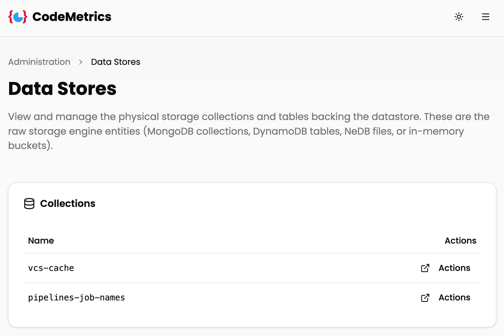
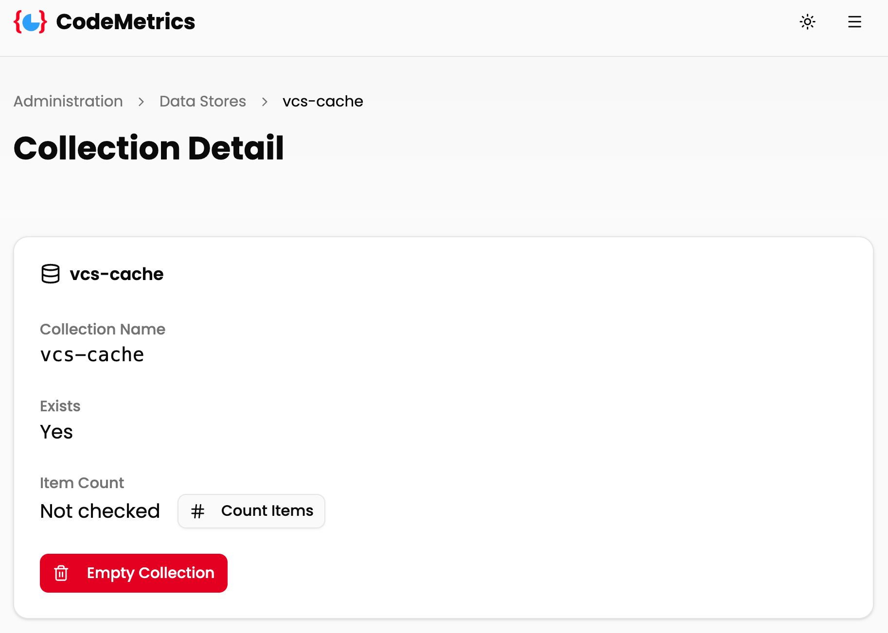

# Data Stores Administration

The Data Stores administration page allows administrators to inspect and manage the physical storage collections and tables that back the CodeMetrics datastore. This operates directly at the storage engine level — MongoDB collections, DynamoDB tables, NeDB files, or in-memory buckets — rather than at the application's logical cache layer.

## Accessing Data Stores

1. Navigate to the Administration section from the main navigation
2. Click on "Data Stores" from the Data Stores card

## Listing Collections

The Data Stores page displays all physical collections currently present in the configured storage backend.

The collections table includes:

- **Name**: The physical collection or table name as it exists in the storage engine
- **Actions**: A link to open the collection detail page

## Collection Detail

Clicking "Actions" on any collection opens the Collection Detail page for that collection.

The detail page shows:

- **Collection Name**: The physical name of the collection in the storage engine
- **Exists**: Whether the collection currently exists in the storage backend (`Yes` / `No`)
- **Item Count**: The number of items stored in the collection (see below)
- **Empty Collection**: A button to permanently delete all items in the collection

### Counting Items

Item counting is a potentially expensive operation and is **not performed automatically** when the page loads. To count the items in a collection, click the **Count Items** button. The result is shown inline and is remembered for the duration of your session on that page.

> [!NOTE]
> After emptying a collection the item count resets to "Not checked". Click **Count Items** again to confirm the collection is empty.

### Emptying a Collection

To remove all items from a collection:

1. Click the **Empty Collection** button
2. Confirm the action in the confirmation dialog

> [!WARNING]
> Emptying a collection permanently deletes all data within it. This action cannot be undone. The collection itself is not deleted — only its contents are removed.

## Storage Backend Notes

The Data Stores page reflects whichever storage backend is active for your deployment (configured via the `DATASTORE_IMPL` environment variable). For details on how each backend maps logical collection names to physical resources, see the [Datastore Collections documentation](./datastore_collections.md).

For more information on configuring the storage backend, see the [Datastores documentation](./datastores.md) and [Caching documentation](./caching.md).

