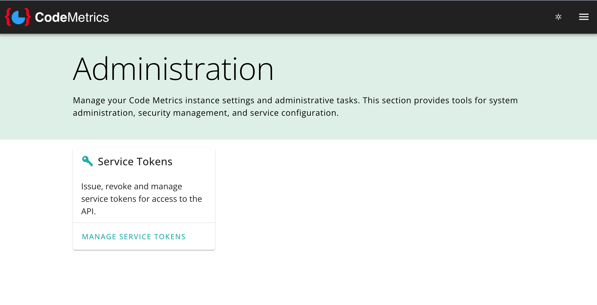
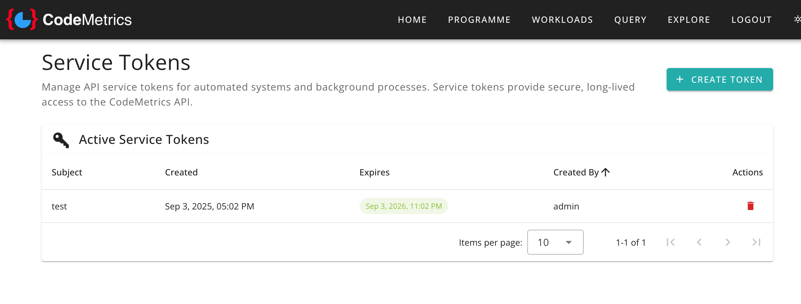
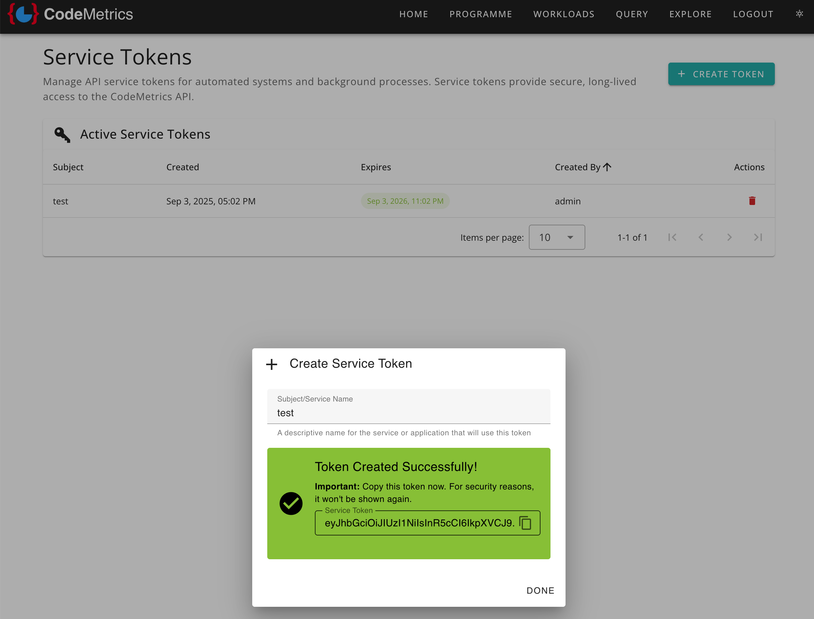
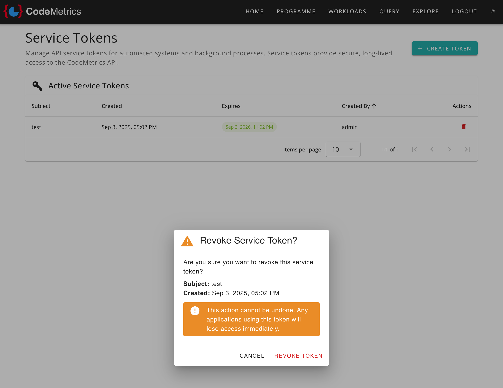

# Administration Portal

The Administration Portal provides system administrators with tools to manage their CodeMetrics instance. Its web interface allows you to configure system-wide settings, manage user access, and perform administrative tasks.

## Overview

The admin portal serves as the central hub for system management activities. An example of an administrative function is managing service tokens for API access.



## Service Token Management

Service tokens provide secure, long-lived access to the CodeMetrics API for automated systems, background processes, and third-party integrations. These tokens can help with:

- Automated data analysis
- CI/CD pipeline integrations
- External monitoring systems

For technical details about using service tokens with the API, see the [API Integration documentation](./integration_api_authentication.md).

### Accessing Service Token Management

1. Navigate to the Administration section from the main navigation
2. Click on "Manage Service Tokens" from the Service Tokens card

### Viewing Active Tokens

The service tokens page displays all currently active tokens in your system:



The tokens table includes:

- **Subject**: A descriptive name for the service or application using the token
- **Created**: When the token was issued
- **Expires**: Token expiration date (tokens expiring within 30 days are highlighted)
- **Created By**: The administrator who issued the token
- **Actions**: Options to revoke the token

### Creating a New Service Token

To create a new service token:

1. Click the "Create Token" button
2. Enter a descriptive subject name for the service or application
3. Click "Create Token"



> [!NOTE]
> Important: After creation, the token value is displayed only once. Copy and store it securely, as it cannot be retrieved again for security reasons.

The token creation dialog includes:
- A copy button for easy clipboard access
- Security warnings about token storage
- Clear instructions for safe handling

### Revoking Service Tokens

To revoke a service token:

1. Click the delete button (trash icon) next to the token in the list
2. Confirm the revocation in the dialogue box



> [!WARNING]
> Revoking a token immediately terminates access for any applications or systems using that token. This action cannot be undone.

The revocation dialogue shows:

- Token details for confirmation
- Clear warnings about the permanent nature of revocation
- Impact on dependent systems

## Security Considerations

### Token Management Best Practices

- **Regular Auditing**: Periodically review active tokens and remove unused ones
- **Descriptive Naming**: Use clear, descriptive subject names to identify token purposes
- **Principle of Least Privilege**: Only create tokens when necessary
- **Secure Storage**: Store tokens securely in your systems (e.g., environment variables, secret managers)
- **Rotation**: Regularly rotate long-lived tokens

### Access Control

- Only administrators can access the Administration Portal
- All token management actions are logged for audit purposes
- Token creation requires proper authentication and authorisation

## Navigation

The administration portal uses breadcrumb navigation to help you understand your current location:

```
Admin > Service Tokens
```

You can return to the main administration page at any time by clicking "Admin" in the breadcrumbs.
