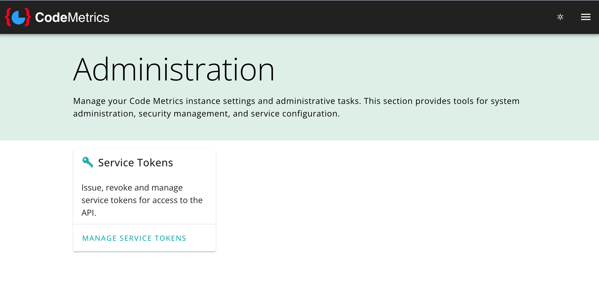

# Administration Portal

The Administration Portal provides system administrators with tools to manage their CodeMetrics instance. Its web interface allows you to configure system-wide settings, manage user access, and perform administrative tasks.

Only users with the **`admin`** role can access the Administration Portal. See [Authorization (RBAC)](./authorization.md) for how to assign roles to users.

## Overview

The admin portal serves as the central hub for system management activities.



## Available Tools

### [Service Tokens](./service_tokens.md)

Manage secure, long-lived API tokens for automated systems, CI/CD pipeline integrations, and third-party tools. Covers creating, viewing, and revoking tokens.

### [Data Stores](./admin_datastores.md)

Inspect and manage the physical storage collections and tables backing the CodeMetrics datastore. Covers listing collections, counting items, and emptying collections.

## Navigation

The administration portal uses breadcrumb navigation to help you understand your current location:

```
Admin > <section>
```

You can return to the main administration page at any time by clicking "Admin" in the breadcrumbs.
