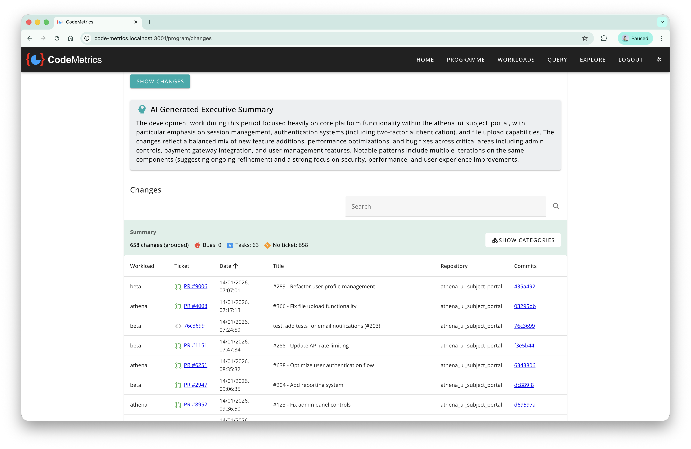

# AI Summaries

AI Summaries provide AI-generated executive summaries of repository changes, helping teams quickly understand development activity across workloads and repositories. This feature uses large language models (LLMs) to analyse commits, pull requests, and associated tickets to produce high-level insights.

## Overview

AI Summaries integrates with leading AI providers to automatically generate contextual summaries of repository changes over selected time periods. The feature analyses commit messages, pull request titles, and ticket information to provide an executive-level overview of what has changed, making it easier for technical and non-technical stakeholders to understand development activity without reviewing individual commits.

AI-generated summaries are valuable for:

- **Executive Reporting**: Quickly understand what has changed across teams and repositories
- **Sprint Reviews**: Generate high-level summaries of work completed during sprint periods
- **Change Communication**: Communicate technical changes to non-technical stakeholders
- **Release Notes**: Get AI assistance in understanding changes for release documentation
- **Cross-Team Visibility**: Understand activity across multiple workloads without deep technical review

## Supported AI Providers

CodeMetrics supports the following AI providers for generating summaries:

| Provider                                                        | Support      |
| --------------------------------------------------------------- | ------------ |
| [Anthropic Claude](https://www.anthropic.com/)                  | ✅ Supported |
| [Google Gemini](https://ai.google.dev/)                         | ✅ Supported |

## Configuration

AI Summaries are configured in your `remote-config.yaml` file under the `llm` section. Only one AI provider can be active at a time.

### Anthropic Claude Configuration

To use Claude for AI summaries:

```yaml
llm:
  type: claude
  claude:
    server:
      id: example-claude
      # API endpoint (optional, defaults to https://api.anthropic.com)
      url: https://api.anthropic.com
      # Get your API key from: https://console.anthropic.com/
      apiKey: "${secret.ANTHROPIC_API_KEY}"
      # Optional: specify model (defaults to claude-sonnet-4-5-20250929)
      model: claude-sonnet-4-5-20250929
```

#### Getting a Claude API Key

1. Visit [https://console.anthropic.com/](https://console.anthropic.com/)
2. Create an account or sign in
3. Navigate to API Keys section
4. Generate a new API key
5. Store the key securely using your [secret management](./secret_management.md) approach

### Google Gemini Configuration

To use Gemini for AI summaries:

```yaml
llm:
  type: gemini
  gemini:
    server:
      id: example-gemini
      # Get your API key from: https://aistudio.google.com/app/apikey
      apiKey: "${secret.GOOGLE_AI_API_KEY}"
      # Optional: specify model (defaults to gemini-1.5-flash)
      model: gemini-1.5-flash
```

#### Getting a Gemini API Key

1. Visit [https://aistudio.google.com/app/apikey](https://aistudio.google.com/app/apikey)
2. Sign in with your Google account
3. Create a new API key
4. Store the key securely using your [secret management](./secret_management.md) approach

### Configuration Notes

- The `type` field determines which provider is used (`claude` or `gemini`)
- API keys should be stored securely using secret management rather than plain text
- The `url` field is optional for Claude and defaults to the official Anthropic API endpoint
- Model selection is optional and will use sensible defaults if not specified
- Only configure one provider at a time - the `type` field determines which configuration is active

For more details on configuration file structure, see [Configuration](./configuration.md).

## Using AI Summaries

AI Summaries are available in the Repository Changes view.

### Accessing the Repository Changes View

Navigate to **Query** → **Repository Changes** to access the changes view where AI summaries are displayed.



### Generating a Summary

1. **Select Parameters**: Choose your workloads, repository groups, and date range for the changes you want to analyse
2. **Fetch Changes**: Click the "Fetch Changes" button to retrieve repository change data
3. **View AI Summary**: Once changes are loaded, an AI-generated executive summary will automatically appear at the top of the results

### Understanding the Summary

The AI-generated summary appears in a dedicated card with the following characteristics:

- **Visual Indicator**: Displayed with a lightbulb icon to indicate AI-generated content
- **Executive Focus**: Summarises high-level themes and patterns across the changes
- **Context-Aware**: Considers commit messages, pull request titles, and ticket information
- **Loading States**: Shows a progress indicator while the summary is being generated
- **Error Handling**: Displays warnings if summary generation encounters issues

The summary provides context on:

- Key features or functionality added
- Bug fixes and improvements
- Development themes and focus areas
- Overall volume and nature of changes

## Requirements

To use the AI Summaries feature:

- An LLM provider must be configured in `remote-config.yaml`
- Valid API credentials for your chosen provider (Claude or Gemini)
- Repository change data must be available (requires code management integration)
- Internet connectivity to reach the AI provider's API endpoint

## Privacy and Data Considerations

When using AI Summaries, consider the following:

- **Data Transmission**: Commit messages, PR titles, and ticket information are sent to the AI provider's API
- **Third-Party Processing**: Data is processed by external AI services (Anthropic or Google)
- **API Usage**: Each summary generation consumes API credits/quota from your provider account
- **Sensitive Information**: Ensure commit messages and PR titles do not contain sensitive information that should not leave your environment

For sensitive or air-gapped environments, you may choose not to enable AI Summaries or use a self-hosted LLM endpoint if your provider supports it.

## Troubleshooting

### Summary Not Appearing

If the AI summary is not displayed:

- Verify that the `llm` section is configured in `remote-config.yaml`
- Check that your API key is valid and has not expired
- Confirm the API key has appropriate permissions and available quota
- Check backend logs for API connectivity or authentication errors
- Ensure there are changes in the selected date range to summarise

### Summary Generation Errors

If an error message appears instead of a summary:

- **API Authentication Error**: Verify your API key is correct and active
- **Rate Limiting**: Check if you have exceeded your API provider's rate limits
- **Network Error**: Confirm network connectivity to the AI provider's endpoint
- **Invalid Configuration**: Ensure only one provider type is configured at a time

### Poor Quality Summaries

If summaries are not useful or contain errors:

- Ensure commit messages and PR titles contain meaningful information
- Consider using a more capable model (e.g., Claude Sonnet instead of Haiku)
- Verify that the date range includes a reasonable amount of changes (too few or too many changes may affect quality)
- Check that repository data is being fetched correctly

## Cost Considerations

AI Summaries consume API credits from your chosen provider:

- **Claude**: Charged per input/output token based on Anthropic's pricing
- **Gemini**: Charged based on Google's Gemini API pricing model

To manage costs:

- Monitor your API usage through your provider's console
- Set up billing alerts with your AI provider
- Consider using less expensive models for routine summaries (e.g., Gemini Flash or Claude Haiku)
- Use more powerful models only when detailed summaries are needed

## Related Features

- **[Repository Changes Query](./queries.md)**: The underlying query that powers the changes view
- **[Configuration](./configuration.md)**: General configuration guidance
- **[Secret Management](./secret_management.md)**: Securely storing API keys
- **[Features](./features.md)**: Overview of AI Agents feature support

## Future Enhancements

Potential future enhancements to AI Summaries may include:

- Support for additional AI providers
- Custom summary templates and prompts
- Summary caching to reduce API costs
- Configurable summary length and detail level
- Multi-language summary generation
- Integration with other views beyond repository changes
