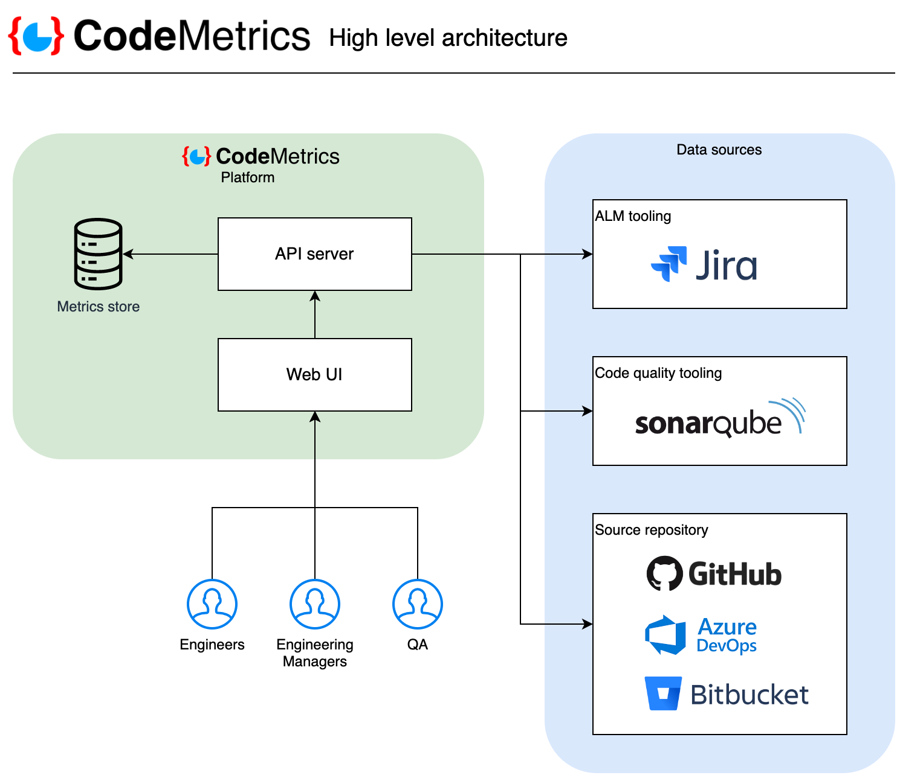
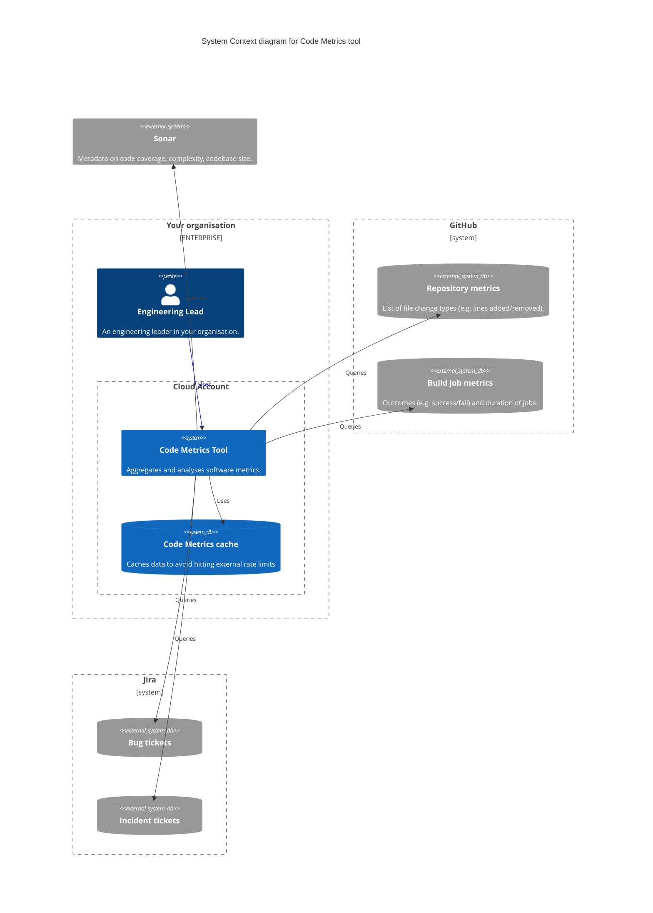
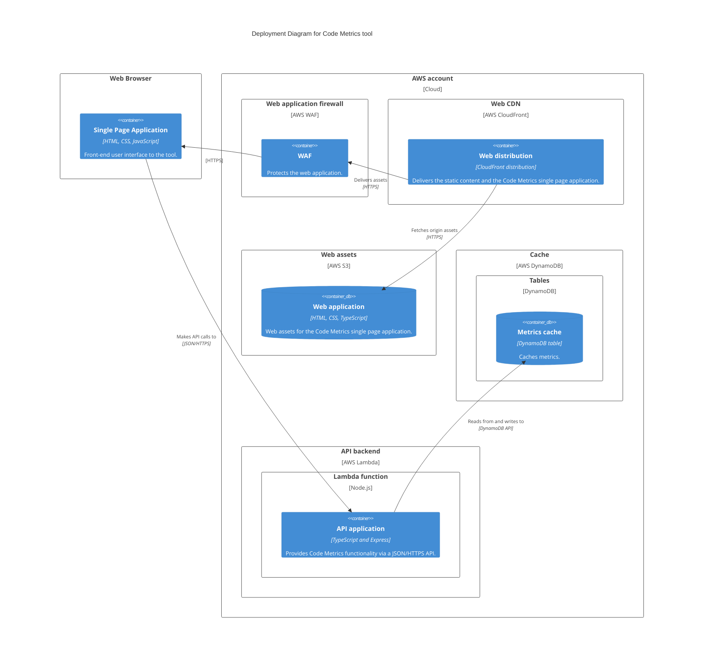

# Architecture

## High level architecture

The tool integrates metrics from your ALM tooling (e.g. Jira), version control system, and code quality tooling (SonarQube).

## System context

Code Metrics queries external systems and presents an analysis of the data across multiple repositories.

## Deployment diagram

An example deployment using AWS Lambda (backend), CloudFront/S3 (frontend) and DynamoDB (cache).

> **Note**
> There are [other ways to run](./getting_started.md) Code Metrics, such as Kubernetes, Docker or plain Node.js. 

## Technology overview

The key application technologies are Node.js/Express for the API server and Vue.js for the UI. TypeScript is the primary language. Some of the analyses use a backing store (MongoDB or DynamoDB are a common choices).

The tool interacts with ALM tooling (Jira), Code quality tools (Sonar) and source control platforms (ADO/Bitbucket/GitHub) typically using their respective HTTPS API. These sources provide the raw data for display or subsequent combined analysis.

Packaging is available via:

1. Docker containers (`node:lts` for the API server and `nginx` for static hosting of the UI). Deployment is to anywhere Docker runs, or Node.js if desired.
2. AWS Lambda function deployment package (ZIP file).

## Configuration

See the [configuration guide](./configuration.md) for more details.
