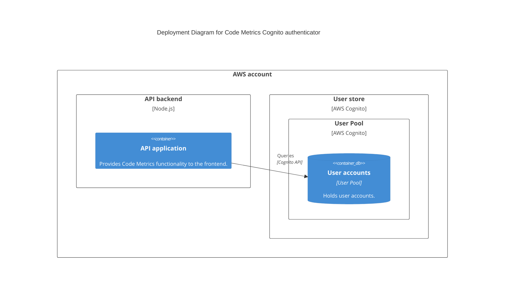

# User authentication

To use Code Metrics users require authentication. You configure how users authenticate using one of the supported authentication providers:

| Name         | Details                                                                                                                                         |
|--------------|-------------------------------------------------------------------------------------------------------------------------------------------------|
| file         | User configuration is represented as password hashes and usernames in a file named `users.json`.                                                |
| azureEntraId | Authenticate against Azure Entra ID using RPOC                                                                                                  |
| cognito      | AWS Cognito user store. This authenticator implementation holds items in an external Cognito instance. It requires appropriate AWS credentials. |
| keycloak     | Direct Grant Keycloak Authentication                                                                                                            |
| ldap         | User is verified against LDAP/AD                                                                                                                |
| oidc         | OpenID Connect (OIDC) Authentication                                                                                                            |

## Setting the authenticator implementation

Set the authenticator implementation to use with the `AUTHENTICATOR_IMPL` environment variable.

> For example:
>
> ```
> AUTHENTICATOR_IMPL=file
> ```

## Configuring the access token secret

Once a user has authenticated with one of the providers, Code Metrics issues them a time-limited token. This token is used by the user's browser when calling the Code Metrics backend APIs.

The token is generated based on a secret - the `ACCESS_TOKEN_SECRET`. This value is sensitive and should be protected, as it is used by the backend to determine whether to trust a token presented by the user's browser.

You can set the `ACCESS_TOKEN_SECRET` environment variable to any string.

> **Important**
> You must ensure that all instances of the backend (e.g. all container instances, or all Lambda instances) share the same value for the `ACCESS_TOKEN_SECRET`, so that they can validate the token issued to the user.

---

## Authentication providers

This section lists the supported authentication providers.

### File-based authenticator (default)

Set the environment variable:

```
AUTHENTICATOR_IMPL=file
```

This authenticator reads a file named `users.json` in your config directory.

The file is a simple key/value map.

```json
[
  {
    "name": "admin",
    "password": "1253509b718dbbeafa4e028afc9a5f667fe17881fdd222e31559ae452029c3a0fe24075565673a9d9ccfd4564bf1a2b9374243ee19b9846256a9b0e260ea0bc0",
    "salt": "0c62b823eb5b9699ff48c1d0c93816d0"
  }
]
```

Copy the example file `users.json.example` to get started.

#### The `userconfig` tool

You can generate entries for the `users.json` using the `userconfig` tool under `tools`.

<details>
<summary>Usage instructions for `userconfig` tool</summary>

Usage:

```
npm run start -- --username <username> --salt <salt>
```

> Note the double dash (`--`) before the arguments when running using `npm`.

If a username and salt are provided, the tool prompts for a password:

```shell
$ npm run start -- -u jane -s somesaltvalue

Set password for jane:
```

Once you type the password, the configuration is generated as follows:

```json
{
  "name": "jane",
  "password": "0f7dee0b90c2e0c1342393153b319d79c421da0ec10248b90a24ea7b78265dc4480d0434fecd3d3b75e7ab7ad221a1f15290ba8b76cd3385ad28e847ecec69ac",
  "salt": "somesaltvalue"
}
```
</details>

### AWS Cognito (via AWS API)

CodeMetrics supports AWS Cognito for user authentication. This is a back-end authentication mechanism, where the CodeMetrics backend queries AWS Cognito to authenticate the user.

Set the environment variable:

```
AUTHENTICATOR_IMPL=cognito
```

This authenticator queries an [AWS Cognito UserPool](https://docs.aws.amazon.com/cognito/latest/developerguide/cognito-user-identity-pools.html).

To use this authenticator:

1. Ensure the Code Metrics backend has the necessary AWS permissions (e.g. using IAM or AWS configuration files) to access the user pool.
2. Create a Cognito Client ID for Code Metrics to use.
3. Create users in the user pool (outside the scope of this documentation).

Configure the user pool and client ID using the following environment variables:

```
COGNITO_CLIENT_ID=ExampleCognitoClientId
COGNITO_USER_POOL_ID=ExampleCognitoUserPoolId
```

#### Architectural overview



### OpenID Connect (OIDC)

CodeMetrics supports [OpenID Connect (OIDC)](https://openid.net/developers/how-connect-works/) for user authentication. This is a front-end authentication flow, where the user is redirected to an OIDC provider to authenticate.

The following example is for Keycloak, but any OIDC provider can be used.

Set the following environment variable to use the OIDC authenticator:

```
AUTHENTICATOR_IMPL=oidc
```

Ensure the UI base URL is set to the address a user will see for the frontend application:

```
UI_BASE_URL=http://localhost:3001
```

The following environment variables must match the configuration of your OIDC provider:

```
OIDC_ISSUER_BASE_URL=http://localhost:8086/realms/codemetrics
OIDC_CLIENT_ID=codemetrics
OIDC_CLIENT_SECRET=changeme
OIDC_SECRET=changeme
```

<details>
<summary>Additional OIDC configuration</summary>

Additional OIDC configuration can be set:

```
OIDC_USER_CLAIM=sub
OIDC_SCOPES=openid profile email
OIDC_AUDIENCE=codemetrics
```
</details>

> **Note**
> If you are using Keycloak, ensure the [Keycloak Realm/Client](https://www.keycloak.org/docs/latest/server_admin/#assembly-managing-clients_server_administration_guide) has OIDC enabled.

> **Note**
> See the [oidc example](../examples/keycloak) for a working example of OIDC authentication with CodeMetrics and Keycloak.

### Azure Entra ID (formerly AzureAD)

CodeMetrics supports Azure Entra ID (formerly AzureAD) for user authentication. This is a back-end authentication mechanism, where the CodeMetrics backend queries Azure Entra ID to authenticate the user.

> **Note**
> Currently, only 'OAuth 2.0 Resource Owner Password Credentials' (ROPC) is supported.

Set the environment variable:

```
AUTHENTICATOR_IMPL=azureEntraId
```

Then configure the following environment variables as needed

Set the following environment variables:
```
AEID_TENANTID='111-1111-1111-1111'
AEID_CLIENTID='2222-2222-222-2222'
AEID_SCOPE='https://graph.microsoft.com/.default'
```

#### Azure Application Setup

 * Create users in [Azure Entra ID](https://portal.azure.com/?quickstart=true#view/Microsoft_AAD_IAM/ActiveDirectoryMenuBlade/~/Overview)
 * [Register your App](https://portal.azure.com/?quickstart=true#view/Microsoft_AAD_RegisteredApps/CreateApplicationBlade/isMSAApp~/false)
 * Enter the App in Azure, then Click authentication on the left -> Supported account types -> Select: 	`Accounts in any organizational directory (Any Microsoft Entra ID tenant - Multitenant)`
 * Enter the App in Azure, then Click authentication on the left, then at the bottom, Advanced settings -> Allow public client flows -> Enable the following mobile and desktop flows: `YES`
 * Enter the App in Azure, then Click Api Permissions on the left, then `Grant admin consent for default directory`

Username is the user's principal name in Entra ID (Which may or may not be their email address)

### LDAP

CodeMetrics supports using an LDAP registry for user authentication. This is a back-end authentication mechanism, where the CodeMetrics backend queries an LDAP store to authenticate the user.

Set the environment variable:

```
AUTHENTICATOR_IMPL=ldap
```

There are two supported methods of LDAP authentication:
1. Bind with Admin Account, search for user and if found attempt to bind as user
2. Attempt to bind with specified user account

Then configure the following environment variables as needed

Set the following environment variables for BOTH Methods:
```
LDAP_URI='ldap://localhost:1389'
LDAP_USER_SEARCH_BASE='ou=users,dc=example,dc=org'
LDAP_ROOT_DN='dc=example,dc=org'
LDAP_USERNAME_ATTRIBUTE='uid'
LDAP_TLS=false
```

To use method 1 (admin bind)
```
LDAP_ADMIN_AUTH=true
LDAP_BIND_DN='cn=admin,dc=example,dc=org'
LDAP_BIND_PASSWORD='admin'
```

To use method 2 (user bind)
```
LDAP_ADMIN_AUTH=false
```

### Keycloak (via Direct Grant)

If you are using [Keycloak](https://www.keycloak.org/) as your identity provider, you can use the Direct Grant flow to authenticate users. This is a backend API call from the CodeMetrics API server to the Keycloak server.

Set the environment variable:

```
AUTHENTICATOR_IMPL=keycloak
```

This authenticator queries the specified Keycloak instance to authenticate the user.

Set the following environment variables:
```
KEYCLOAK_URI='http://127.0.0.1:8086';
KEYCLOAK_REALM='codemetrics';
KEYCLOAK_CLIENT_ID='codemetrics';
```

Keycloak Realm/Client should be configured to have `Direct access grants` enabled for this to work.
