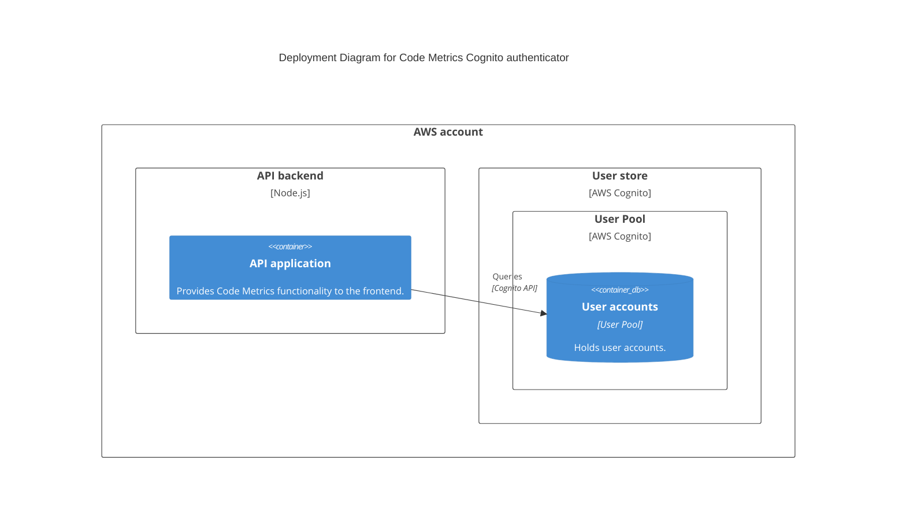

# User authentication

To use Code Metrics users require authentication. You configure how users authenticate using one of the supported authentication providers:

| Name    | Details                                                                                                                                         |
|---------|-------------------------------------------------------------------------------------------------------------------------------------------------|
| file    | User configuration is represented as password hashes and usernames in a file named `users.json`.                                                |
| cognito | AWS Cognito user store. This authenticator implementation holds items in an external Cognito instance. It requires appropriate AWS credentials. |

## Setting the authenticator implementation

Set the authenticator implementation to use with the `AUTHENTICATOR_IMPL` environment variable.

> For example:
>
> ```
> AUTHENTICATOR_IMPL=file
> ```

### File-based authenticator (default)

Set the environment variable:

```
AUTHENTICATOR_IMPL=file
```

This authenticator reads a file named `users.json` in your config directory.

The file is a simple key/value map.

```json
[
  {
    "name": "admin",
    "password": "1253509b718dbbeafa4e028afc9a5f667fe17881fdd222e31559ae452029c3a0fe24075565673a9d9ccfd4564bf1a2b9374243ee19b9846256a9b0e260ea0bc0",
    "salt": "0c62b823eb5b9699ff48c1d0c93816d0"
  }
]
```

Copy the example file `users.json.example` to get started.

#### The `userconfig` tool

You can generate entries for the `users.json` using the `userconfig` tool under `backend/tools`.

<details>
<summary>Usage instructions for `userconfig` tool</summary>

Usage:

```
npm run start -- --username <username> --salt <salt>
```

> Note the double dash (`--`) before the arguments when running using `npm`.

If a username and salt are provided, the tool prompts for a password:

```shell
$ npm run start -- -u jane -s somesaltvalue

Set password for jane:
```

Once you type the password, the configuration is generated as follows:

```json
{
  "name": "jane",
  "password": "0f7dee0b90c2e0c1342393153b319d79c421da0ec10248b90a24ea7b78265dc4480d0434fecd3d3b75e7ab7ad221a1f15290ba8b76cd3385ad28e847ecec69ac",
  "salt": "somesaltvalue"
}
```
</details>

### AWS Cognito authenticator

Set the environment variable:

```
AUTHENTICATOR_IMPL=cognito
```

This authenticator queries an [AWS Cognito UserPool](https://docs.aws.amazon.com/cognito/latest/developerguide/cognito-user-identity-pools.html).

To use this authenticator:

1. Ensure the Code Metrics backend has the necessary AWS permissions (e.g. using IAM or AWS configuration files) to access the user pool.
2. Create a Cognito Client ID for Code Metrics to use.
3. Create users in the user pool (outside the scope of this documentation).

Configure the user pool and client ID using the following environment variables:

```
COGNITO_CLIENT_ID=ExampleCognitoClientId
COGNITO_USER_POOL_ID=ExampleCognitoUserPoolId
```

#### Architectural overview



### Azure Entra ID (Formerly AzureAD)

Currently only:  OAuth 2.0 Resource Owner Password Credentials (ROPC) is supported.

Set the environment variable:

```
AUTHENTICATOR_IMPL=azureEntraId
```

Then configure the following Env Vars as needed

Set the following Env Vars:
```
AEID_TENANTID='111-1111-1111-1111'
AEID_CLIENTID='2222-2222-222-2222'
AEID_SCOPES='https://graph.microsoft.com/.default'
```

#### Azure Application Setup
 * Create users in [Azure Entra ID](https://portal.azure.com/?quickstart=true#view/Microsoft_AAD_IAM/ActiveDirectoryMenuBlade/~/Overview)
 * [Register your App](https://portal.azure.com/?quickstart=true#view/Microsoft_AAD_RegisteredApps/CreateApplicationBlade/isMSAApp~/false)
 * Enter the App in Azure, then Click authentication on the left -> Supported account types -> Select: 	`Accounts in any organizational directory (Any Microsoft Entra ID tenant - Multitenant)`
 * Enter the App in Azure, then Click authentication on the left, then at the bottom, Advanced settings -> Allow public client flows -> Enable the following mobile and desktop flows: `YES`
 * Enter the App in Azure, then Click Api Permissions on the left, then `Grant admin consent for default directory`

Username is the user's principal name in Entra ID (Which may or may not be their email address)
