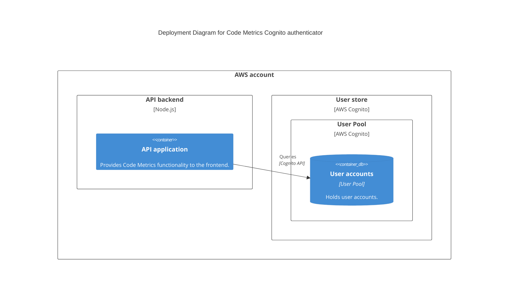

# Cognito Authentication

## Introduction

CodeMetrics supports AWS Cognito for user authentication. This is a back-end authentication mechanism, where the CodeMetrics backend queries AWS Cognito to authenticate the user.

## Configuration

Set the environment variable:

```
AUTHENTICATOR_IMPL=cognito
```

This authenticator queries an [AWS Cognito UserPool](https://docs.aws.amazon.com/cognito/latest/developerguide/cognito-user-identity-pools.html).

To use this authenticator:

1. Ensure the Code Metrics backend has the necessary AWS permissions (e.g. using IAM or AWS configuration files) to access the user pool.
2. Create a Cognito Client ID for Code Metrics to use.
3. Create users in the user pool (outside the scope of this documentation).

Configure the user pool and client ID using the following environment variables:

```
COGNITO_CLIENT_ID=ExampleCognitoClientId
COGNITO_USER_POOL_ID=ExampleCognitoUserPoolId
```

## Architectural overview


