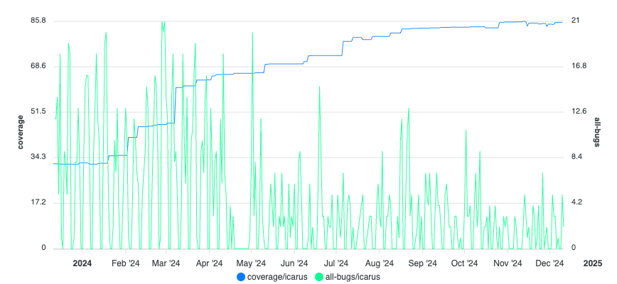
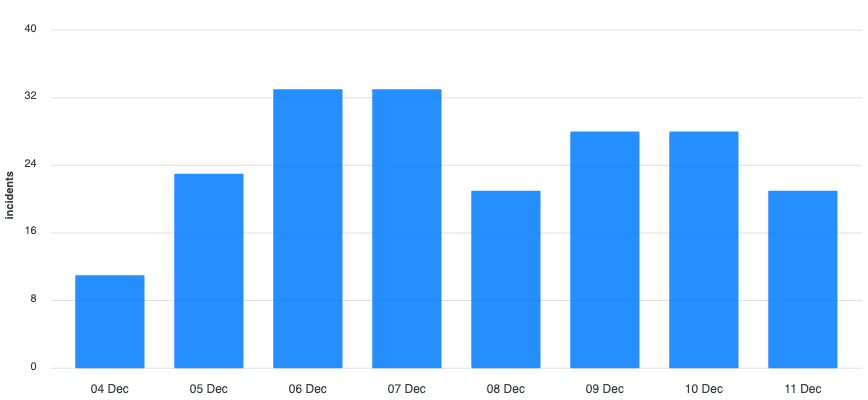
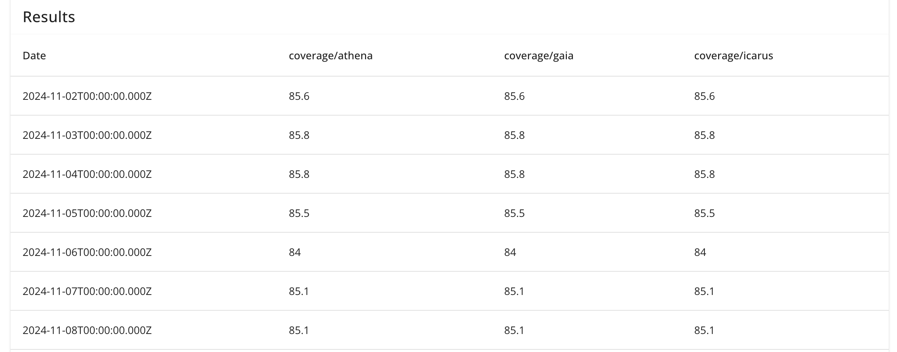

# Chart types

CodeMetrics supports a variety of chart types to help you visualise your data.

The supported chart types are:

- [Line chart](#line-chart)
- [Bar chart](#bar-chart)
- [Doughnut chart](#doughnut-chart)
- [Table](#table)

Select the chart type that best suits your data and the story you want to tell.

## Chart types

### Line chart

Line charts are used to show trends over time. They are particularly useful for showing changes in continuous data over time.

### Bar chart

Bar charts are used to compare different categories of data. They are particularly useful for showing changes over time or comparing different groups.

### Doughnut chart

Doughnut charts are used to show the proportion of different categories of data. They are particularly useful for showing the distribution of data.

### Table

Tables are used to show data in a tabular format.

## Other features

### Data labels

You can enable data labels on your charts. This can be useful for showing the exact values of the data points on the chart.

### Exporting data

You can export the data used to generate the charts in CSV format. This can be useful for further analysis or sharing the data with others.
