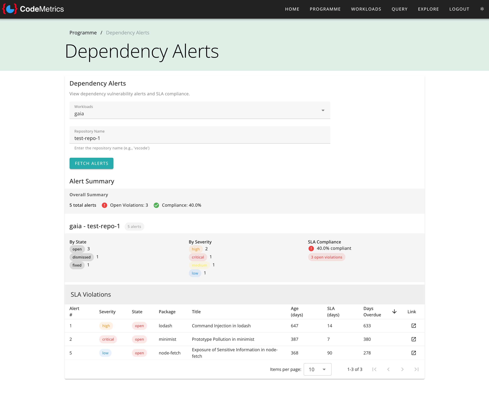
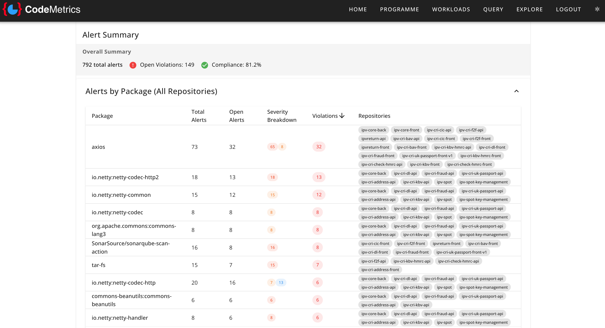

# Dependency Alerts

Dependency Alerts provide visibility into security vulnerabilities in your project dependencies, tracking remediation progress against defined Service Level Agreements (SLAs). This feature helps engineering teams identify, prioritise, and address security risks in third-party packages and libraries.

## Overview

Dependency Alerts integrates with GitHub Dependabot to provide comprehensive security monitoring across your repositories. The feature displays vulnerability information organised by workload and repository, with automatic SLA tracking based on severity levels to ensure timely remediation of security issues.

Understanding your dependency security posture is critical for:

- **Risk Management**: Identifying critical vulnerabilities that require immediate attention
- **Compliance**: Meeting security standards and regulatory requirements
- **SLA Tracking**: Monitoring remediation timelines against defined service level agreements
- **Trend Analysis**: Understanding how security posture changes over time
- **Priority Setting**: Focussing remediation efforts on the highest-risk vulnerabilities

The dashboard displays vulnerability alerts with colour-coded severity indicators and SLA compliance status, making it easy to identify which alerts require immediate action.

## Accessing Dependency Alerts

Dependency Alerts can be viewed at two levels:

### Programme Level

Navigate to **Programme** → **Dependency Alerts** to view dependency vulnerabilities across all workloads and repositories.

From this view, you can:

- Select one or more workloads to analyse
- Specify the repository name
- View aggregated vulnerability data across selected workloads
- Compare security posture between different workloads

### Workload Level

Navigate to **Workloads** → _[Select Workload]_ → **Dependency Alerts** to view dependency vulnerabilities for a specific workload.

From this view, the workload is pre-selected, and you can:

- Specify the repository name
- View vulnerability data specific to that workload
- Track remediation progress for the selected workload's repositories

## Using the Dependency Alerts Dashboard

### Filtering and Search

At the top of the dashboard, you can:

1. **Select Workloads**: Choose one or more workloads from the dropdown menu
2. **Enter Repository Name**: Specify the repository you want to analyse (e.g., "code-metrics", "my-application")
3. **Fetch Alerts**: Click the "Fetch Alerts" button to retrieve and analyse vulnerability data

### Understanding the Summary View

Once data is loaded, the dashboard displays an overall summary showing:

- **Total Alerts**: The aggregate number of vulnerability alerts across all selected workloads
- **Open Violations**: Number of open alerts that exceed their SLA remediation timeframe
- **Compliance Rate**: Percentage of alerts that are within SLA or have been addressed appropriately

The summary provides an at-a-glance view of your security posture and highlights areas requiring immediate attention.

#### Alerts grouped by package

Alerts are also grouped by package, helping you discover clusters of dependency alerts. Expand the "Alerts by Package" section by clicking on it.

### Workload-Specific Analysis

Below the overall summary, each workload displays its own analysis card containing:

#### Header Information

- **Workload Name**: The workload being analysed
- **Repository Name**: The specific repository containing the alerts
- **Alert Count**: Total number of vulnerability alerts for this workload/repository combination

#### Breakdown by State

Alerts are categorised by their current state:

- **Open**: Alerts that have been identified and are awaiting remediation
- **Dismissed**: Alerts that have been reviewed and intentionally dismissed (e.g., false positives, accepted risk)
- **Fixed**: Alerts that have been successfully remediated

#### Breakdown by Severity

Alerts are categorised using colour-coded severity indicators:

- **Critical** (Red): Vulnerabilities requiring immediate attention with the highest potential impact
- **High** (Orange): Serious vulnerabilities that should be addressed urgently
- **Medium** (Yellow): Moderate vulnerabilities requiring timely remediation
- **Low** (Blue): Lower-risk vulnerabilities that should be addressed as capacity allows

#### SLA Compliance

The compliance section shows:

- **Compliance Rate**: Percentage of alerts meeting their SLA requirements
- **Status Indicator**: Green checkmark for full compliance, red alert icon for violations
- **Open Violations Count**: Number of alerts currently exceeding their SLA timeframe

### SLA Timeframes

Remediation SLAs are automatically assigned based on vulnerability severity:

| Severity | SLA Timeframe | Description                                              |
|----------|---------------|----------------------------------------------------------|
| Critical | 7 days        | Must be remediated within one week of identification     |
| High     | 14 days       | Must be remediated within two weeks of identification    |
| Medium   | 30 days       | Must be remediated within one month of identification    |
| Low      | 60 days       | Must be remediated within two months of identification   |

Alerts are considered in violation once they exceed their assigned SLA timeframe and remain in an "open" state.

These SLA timeframes can be customised using environment variables. See [Environment Variables](./env_vars.md) for configuration options:

- `DEPENDENCY_ALERT_CRITICAL` - Days allowed for critical severity alerts (default: 7)
- `DEPENDENCY_ALERT_HIGH` - Days allowed for high severity alerts (default: 14)
- `DEPENDENCY_ALERT_MEDIUM` - Days allowed for medium severity alerts (default: 30)
- `DEPENDENCY_ALERT_LOW` - Days allowed for low severity alerts (default: 60)

### SLA Violations Table

When SLA violations are present, a detailed table displays:

- **Alert Number**: The unique identifier for the vulnerability alert
- **Severity**: Colour-coded severity level
- **State**: Current status of the alert (with colour-coded indicator)
- **Package**: The affected dependency package name
- **Title**: Brief description of the vulnerability
- **Age (days)**: Number of days since the alert was first identified
- **SLA (days)**: The remediation timeframe for this severity level
- **Days Overdue**: How many days the alert has exceeded its SLA
- **Link**: Direct link to the full vulnerability details on GitHub

The table is sortable by any column, allowing you to prioritise remediation efforts based on:

- Days overdue (most urgent violations first)
- Severity (highest risk first)
- Age (oldest alerts first)
- Package name (group by dependency)

## Data Source

Dependency Alerts data is sourced from GitHub Dependabot, which automatically:

- Scans your repository dependencies for known vulnerabilities
- Cross-references against public vulnerability databases (CVE, GHSA)
- Updates alerts as new vulnerabilities are discovered
- Tracks the status of each alert through its lifecycle

### Requirements

To use the Dependency Alerts feature:

- Repositories must be hosted on GitHub
- Dependabot must be enabled for your repositories
- The CodeMetrics workload must be configured with appropriate GitHub API access
- The authenticated user/service account must have permissions to view security alerts

## Related Features

- **[Vulnerabilities Query](query_vulnerabilities.md)**: Query-based vulnerability analysis across workloads
- **[Vulnerability Report Upload](vulnerability_report_upload.md)**: Upload SARIF vulnerability reports
- **[Quality Gates](quality_gates_user.md)**: Automated quality and security checks

## Troubleshooting

### No Data Displayed

If no alerts are shown:

- Verify the repository name is entered correctly
- Confirm Dependabot is enabled for the specified repository
- Check that the workload has appropriate GitHub API credentials configured
- Ensure the repository exists and is accessible with the configured credentials

### Incomplete Data

If alerts appear to be missing:

- Verify API permissions include access to security alerts
- Check GitHub API rate limits have not been exceeded
- Confirm Dependabot has completed its initial scan of the repository

### Unexpected SLA Violations

If compliance rates seem incorrect:

- Verify alert dates against actual identification times in GitHub
- Check for alerts that were dismissed and later reopened
- Review any recently changed SLA configuration

For additional support, consult your CodeMetrics administrator or refer to the [configuration documentation](configuration.md).
