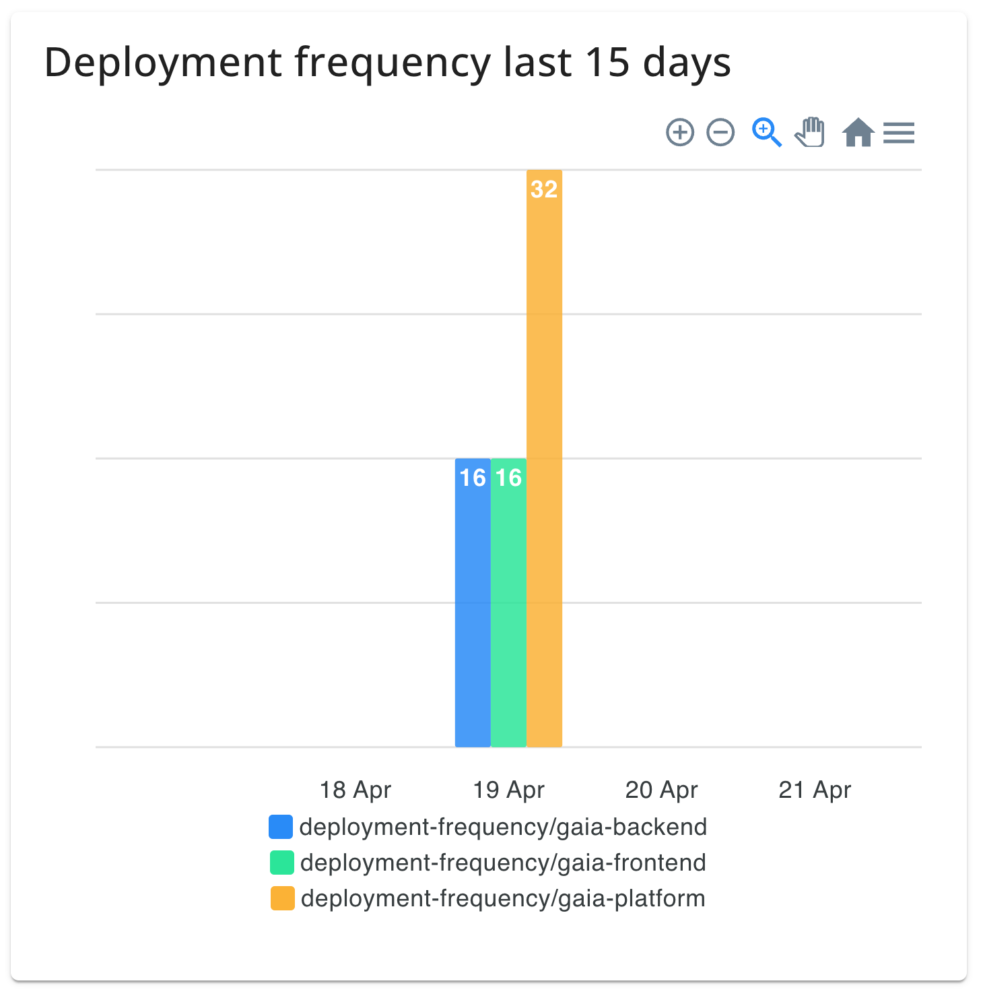
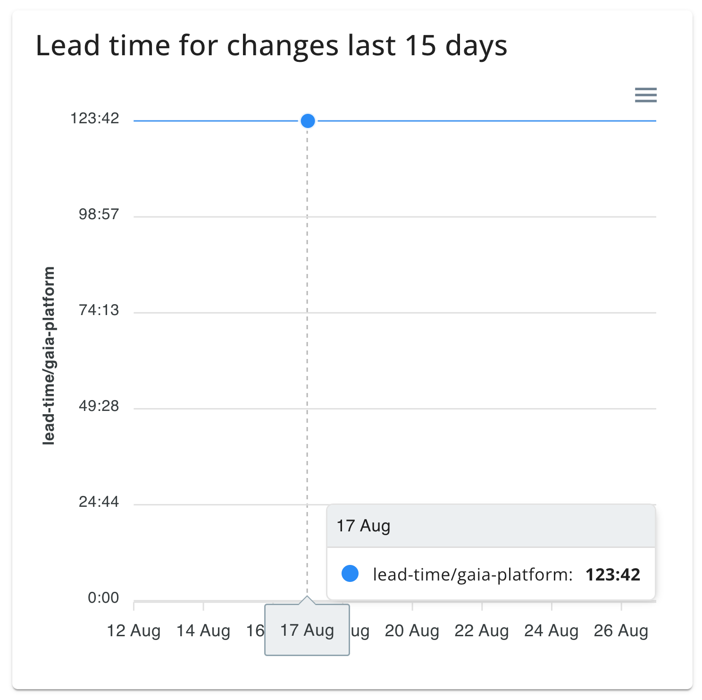
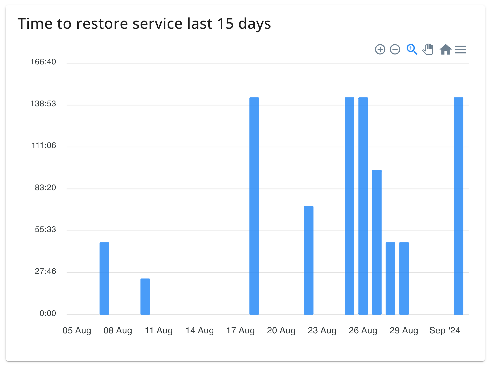
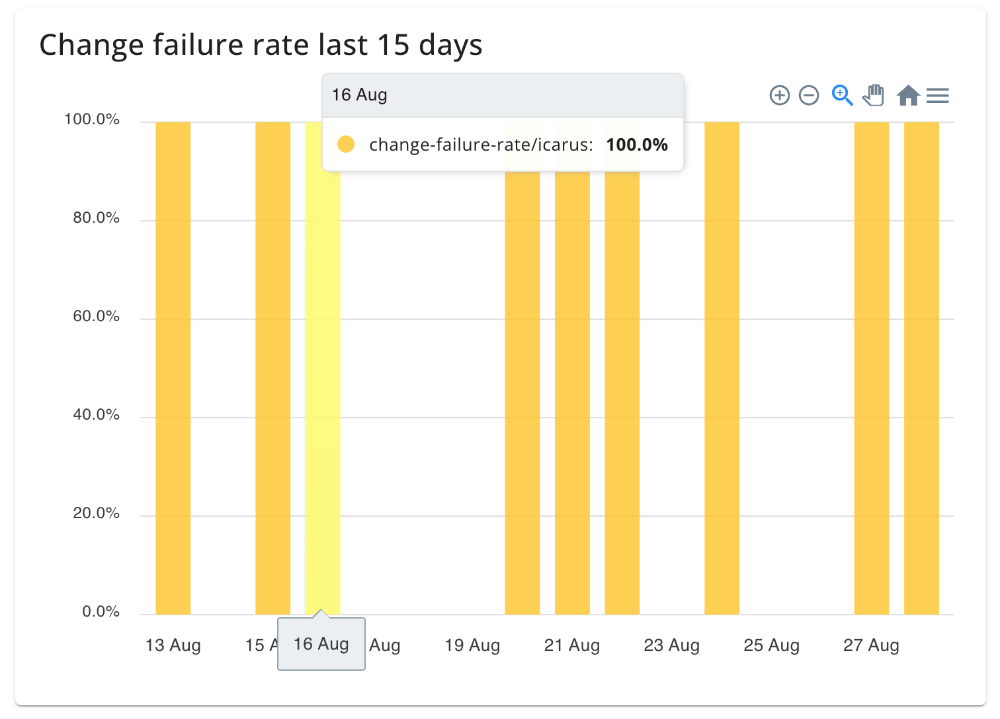

# DORA metrics

CodeMetrics can measure the four key metrics used in the [DORA State of DevOps Report](https://dora.dev/publications/) and [Accelerate](https://nicolefv.com/writing) that relate to software delivery performance. These metrics provide objective, quantifiable measures of organisational effectiveness in software delivery.

## Overview

The DORA (DevOps Research and Assessment) metrics were developed to help organisations measure and improve their software delivery capabilities. CodeMetrics enables you to collect and analyse these metrics automatically from your deployment infrastructure.

The four DORA metrics are:

- **Deployment frequency**: How often you release code to production
- **Lead time for changes**: The time from code commit to production deployment
- **Time to restore service**: The time taken to recover from production incidents
- **Change failure rate**: The percentage of changes that cause production incidents

### Prerequisites

To calculate DORA metrics you must configure your deployment infrastructure. See [Deployment configuration](./config_deployments.md) for detailed setup instructions.

DORA metrics must be explicitly enabled by setting the environment variable `FEATURE_DORA_METRICS=true` on your CodeMetrics instance.

## Deployment frequency

### Definition

Deployment frequency is the number of deployments to production per unit of time. This metric measures how often your organisation successfully releases code to production.

### What it measures

Deployment frequency indicates your organisation's ability to deliver value continuously. Higher deployment frequency typically correlates with:

- Faster feedback loops
- Reduced risk per deployment
- Improved ability to respond to market changes
- Better coordination between teams

### Performance bands

The DORA research identifies the following performance bands for deployment frequency:

| Performance Level | Deployment Frequency                     |
| ----------------- | ---------------------------------------- |
| Elite             | Multiple deployments per day             |
| High              | Between once per day and once per week   |
| Medium            | Between once per week and once per month |
| Low               | Fewer than once per month                |

### Interpretation

A high deployment frequency demonstrates that your organisation has:

- Effective continuous integration and continuous deployment (CI/CD) practices
- Robust automated testing and quality assurance processes
- Well-established deployment automation
- Low-risk deployment procedures



## Lead time for changes

### Definition

Lead time for changes is the time taken from code commit to code successfully running in production. This metric measures your organisation's capacity to translate ideas into deployed, running software.

### What it measures

Lead time for changes indicates the speed of your development pipeline and the efficiency of your delivery process. Shorter lead times suggest:

- Streamlined development processes
- Effective CI/CD automation
- Minimal manual review and approval steps
- High team productivity

### Performance bands

The DORA research identifies the following performance bands for lead time for changes:

| Performance Level | Lead Time                    |
| ----------------- | ---------------------------- |
| Elite             | Less than one hour           |
| High              | Between one hour and one day |
| Medium            | Between one day and one week |
| Low               | More than one week           |

### Interpretation

A shorter lead time demonstrates:

- Efficient review and approval workflows
- Well-optimised build and deployment pipelines
- Effective collaboration between development, operations, and quality teams
- Reduced friction in the change deployment process



## Time to restore service

### Definition

Time to restore service is the time required to restore normal service following a production incident. This metric measures your organisation's ability to respond to and recover from service disruptions.

### What it measures

Time to restore service (MTTR - Mean Time to Repair) indicates your organisation's resilience and incident response capabilities. A lower MTTR suggests:

- Effective monitoring and alerting systems
- Well-trained incident response teams
- Mature runbooks and procedures
- Quick problem diagnosis and resolution

### Performance bands

The DORA research identifies the following performance bands for time to restore service:

| Performance Level | Recovery Time                |
| ----------------- | ---------------------------- |
| Elite             | Less than one hour           |
| High              | Between one hour and one day |
| Medium            | Between one day and one week |
| Low               | More than one week           |

### Interpretation

A shorter recovery time demonstrates:

- Effective operational observability and monitoring
- Clear incident response procedures
- Well-trained on-call and support teams
- Robust system design and redundancy



## Change failure rate

### Definition

Change failure rate is the percentage of changes that result in degraded service or incidents requiring remediation. This metric measures the quality and stability of your deployments.

### What it measures

Change failure rate indicates the reliability of your deployment process and code quality. A lower change failure rate suggests:

- Effective testing and quality assurance practices
- Robust code review processes
- Well-designed automated test suites
- High code quality standards

### Performance bands

The DORA research identifies the following performance bands for change failure rate:

| Performance Level | Failure Rate |
| ----------------- | ------------ |
| Elite             | 0–15%        |
| High              | 16–30%       |
| Medium            | 31–45%       |
| Low               | 46–60%       |

### Interpretation

A lower change failure rate demonstrates:

- Comprehensive automated testing at all levels (unit, integration, end-to-end)
- Effective code review and quality gates
- Strong development practices and coding standards
- High confidence in deployment procedures



---

## Enabling DORA metrics

DORA metrics must be enabled for your CodeMetrics instance before they become available. To enable DORA metrics:

1. Set the environment variable:

   ```
   FEATURE_DORA_METRICS=true
   ```

2. Restart your CodeMetrics instance

Once enabled, DORA metrics will be calculated automatically for all configured workloads and deployments.

## Accessing DORA metrics

### Viewing metrics in the Workloads section

To view DORA metrics for a specific workload:

1. Navigate to the [Workloads](./workloads.md) section
2. Select the workload you wish to analyse
3. Click the **DORA** tab to display all four metrics for that workload
4. Metrics are displayed as graphs showing trends over time
5. Use the date range selector to focus on specific time periods

### Using DORA metrics in queries

To incorporate DORA metrics into custom queries:

1. Navigate to the [Queries](./queries.md) page
2. Create a new query or edit an existing query
3. From the metrics dropdown, select the DORA metric you wish to use:
   - Deployment frequency
   - Lead time for changes
   - Time to restore service
   - Change failure rate
4. Configure additional query parameters (workload, date range, etc.)
5. Execute the query to view results

---

## Interpreting DORA metrics

### Using metrics for improvement

DORA metrics serve multiple purposes:

- **Baseline measurement**: Establish current performance levels as a baseline for improvement
- **Goal setting**: Set realistic targets for each metric based on your organisation's context
- **Trend analysis**: Monitor improvements or regressions over time
- **Comparative analysis**: Compare performance across teams, projects, or time periods
- **Root cause analysis**: Identify bottlenecks or issues affecting specific metrics

### Holistic assessment

No single DORA metric provides a complete picture of organisational performance. Consider all four metrics together:

- **Deployment frequency and lead time for changes** indicate delivery speed
- **Time to restore service and change failure rate** indicate delivery stability
- A balance between speed and stability indicates a mature, high-performing organisation

### Context and limitations

When interpreting DORA metrics, consider:

- Different types of systems may have different baseline metrics
- External factors (e.g., regulatory requirements) may impact metrics
- Metrics should be used to identify improvement opportunities, not for individual performance evaluation
- Improvements in metrics should correlate with business outcomes

## Best practices

- **Regular review**: Review DORA metrics regularly (weekly or monthly) with your team
- **Identify trends**: Look for sustained improvements or regressions rather than single data points
- **Cross-functional analysis**: Involve development, operations, and quality teams in metric analysis
- **Actionable insights**: Use metrics to identify specific areas for process improvement
- **Shared goals**: Align team goals with DORA metric targets
- **Continuous improvement**: Implement changes incrementally and measure their impact

## Further reading

- [DORA State of DevOps Report](https://dora.dev/publications/)
- [Accelerate: The Science Behind Devops](https://nicolefv.com/writing)
- [DORA Research](https://dora.dev/research/)
- [Deployment configuration guide](./config_deployments.md)
- [Queries and analysis](./queries.md)
