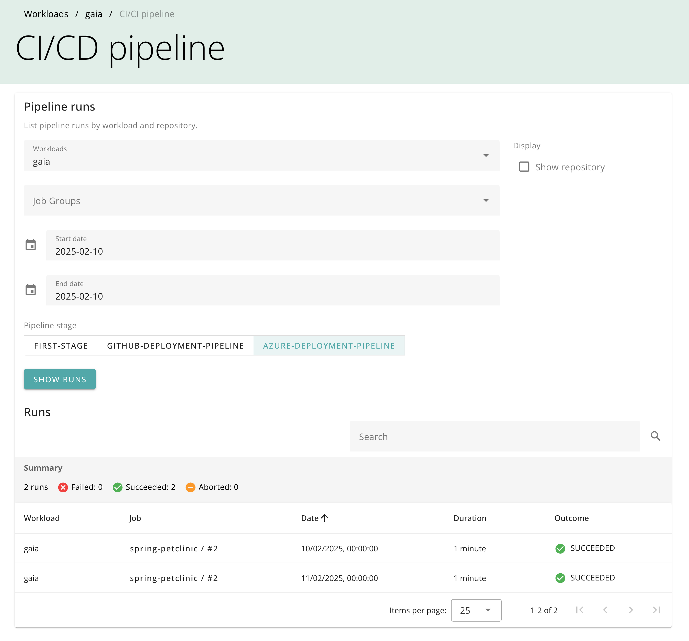
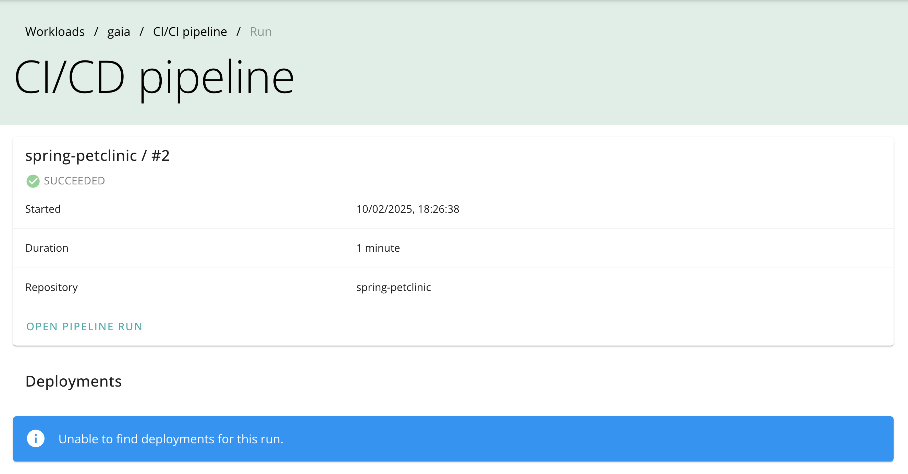
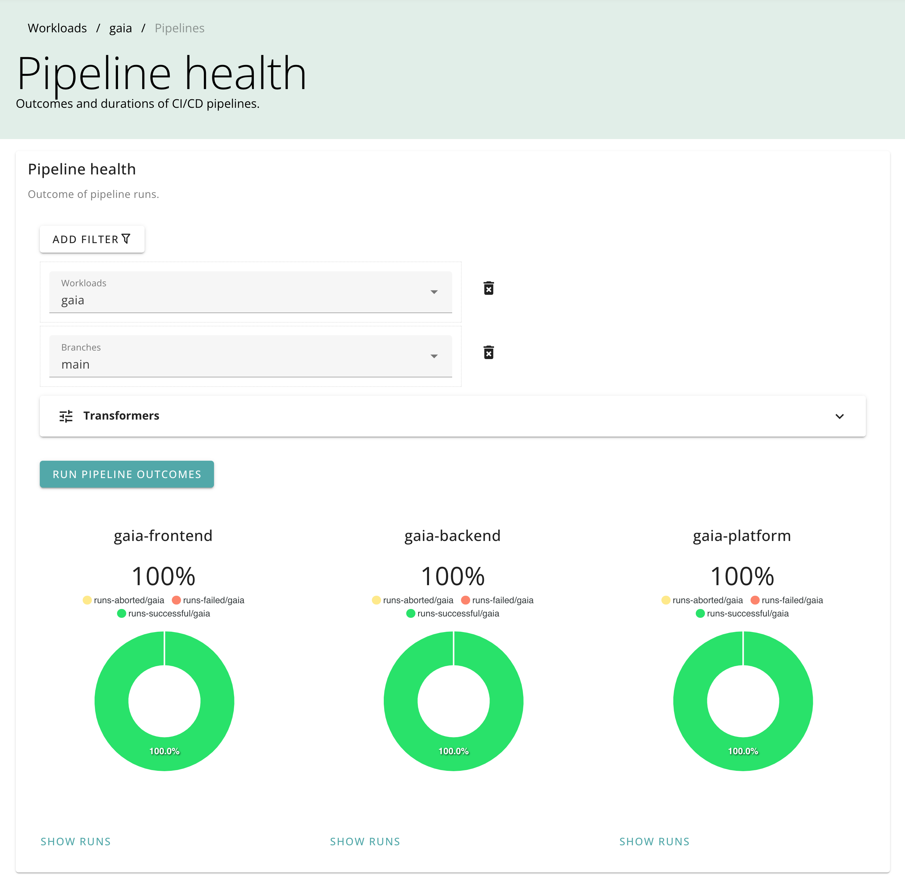

# CI/CD pipelines

## Overview

CodeMetrics provides two views of your CI/CD pipelines:

- **Pipeline runs**: A list of all the pipeline runs for a repository.
- **Pipeline health**: A summary of the health of your CI/CD pipelines.

## Pipeline runs

The pipeline runs view shows all the pipeline runs for a repository. You can filter the list by workload job group, stage, and date range.

Each pipeline run shows:

- The pipeline run ID.
- The pipeline run status.
- The pipeline run duration.
- The pipeline run workload job group.

### Pipeline run details

Click on a pipeline run to see more details:

If any downstream jobs are detected, they are shown in the details view.

## Pipeline health

The pipeline health view shows a summary of the health of your CI/CD pipelines. It shows the number of pipeline runs, the proportion of successful pipeline runs.

