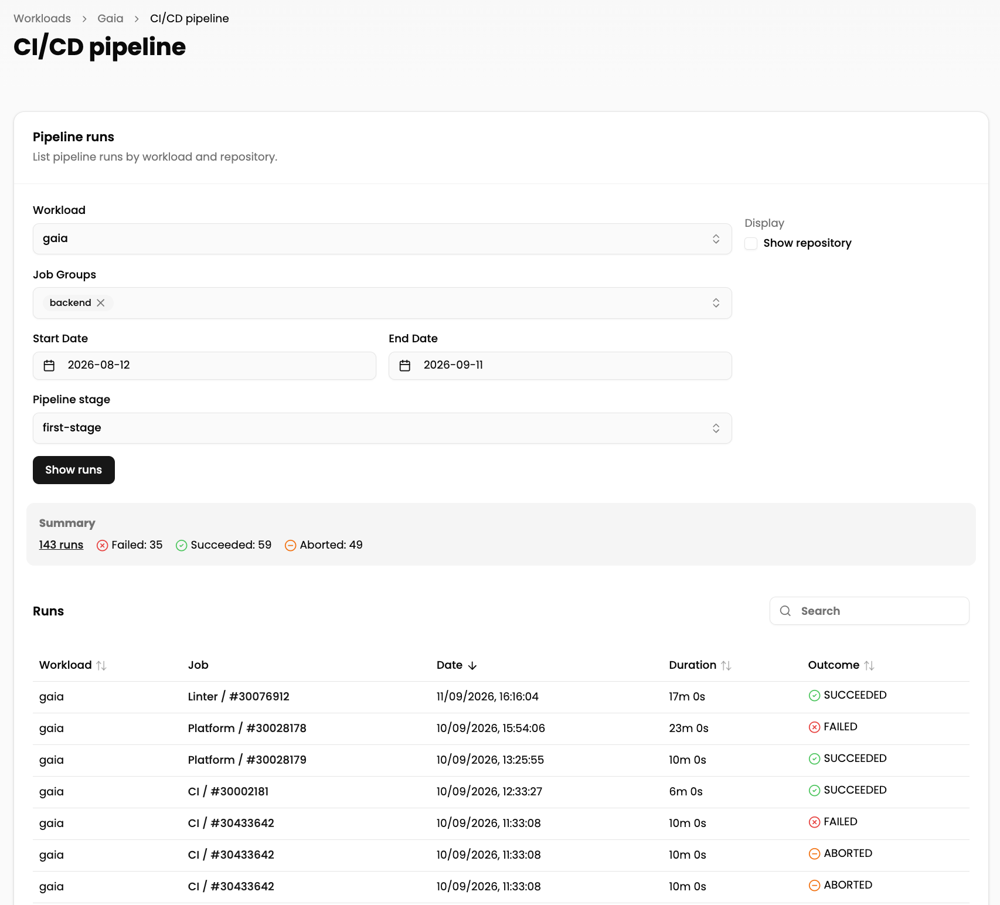
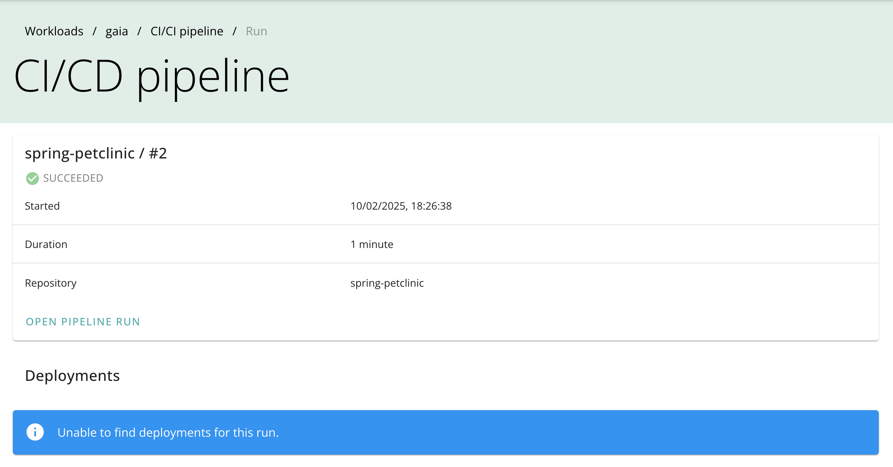

# CI/CD pipelines

## Overview

CodeMetrics provides two views of your CI/CD pipelines:

- **Pipeline runs**: A list of all the pipeline runs for a repository.
- **Pipeline health**: A summary of the health of your CI/CD pipelines.

## Pipeline runs

The pipeline runs view shows all the pipeline runs for a repository. You can filter the list by workload job group, stage, and date range.

Each pipeline run shows:

- The pipeline run ID.
- The pipeline run status.
- The pipeline run duration.
- The pipeline run workload job group.

### Pipeline run details

Click on a pipeline run to see more details:

If any downstream jobs are detected, they are shown in the details view.

## Pipeline health

The pipeline health view shows a summary of the health of your CI/CD pipelines. It shows the number of pipeline runs, the proportion of successful pipeline runs.

A single set of query filters (workloads, pipeline stage, branch, and date range) applies to all selected workloads. By default every configured workload is included and the first configured pipeline stage is used. After executing the query, one card is shown per workload and job group with the success percentage, a breakdown of the run outcomes, and a link to the matching [pipeline runs](#pipeline-runs) view.

### Pipeline query builder

The pipeline query builder is a per-workload variant of the pipeline health view. It is available from the pipelines card on the programme page and from the pipeline health section of a workload page, and can be deep-linked with a `workloadId` query parameter.
