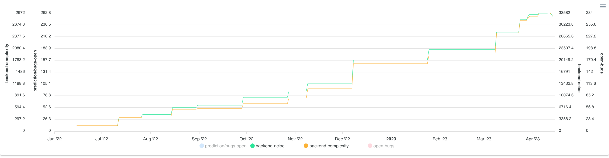
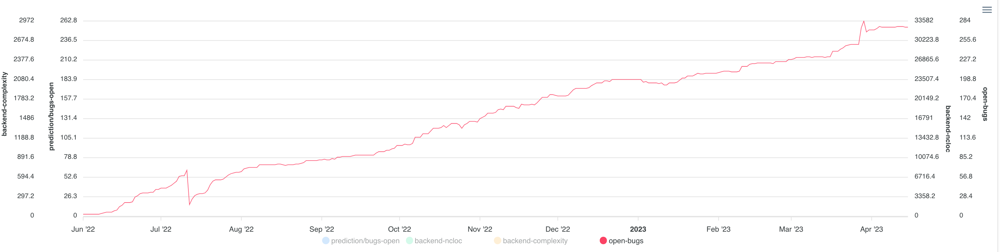
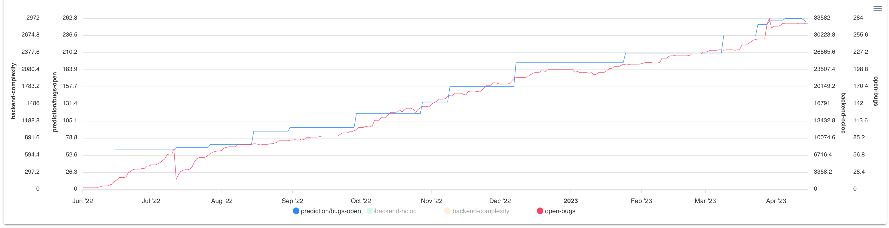

# Prediction using machine learning

Generates predictions based on one or two input datasets.

> **Warning**
> Prediction is an experimental feature.

## Enabling the feature

Set the following environment variable in the backend:

    EXPERIMENTAL_FEATURE_PREDICTIONS=true

## Implementation notes

- uses [TensorFlow](https://www.tensorflow.org/)
- supports a maximum of two input datasets

## Example

### Two input datasets

Here the inputs are lines of code (ncloc) and complexity.

### Label dataset

The label dataset used to train the model is 'number of open bugs'.

### Set up

Here is the UI with the inputs and labels set up.

### Training

When the user hits the `Run Prediction` button, the backend runs the input queries and the label query as normal. Before a response is returned, however, the input dataset results and the label dataset results are used to train a simple neural network using TensorFlow.

The network is trained for 500 iterations, or 'epochs' with a loss function (in this case `meanSquaredError`) used to optimise the network so its outputs match ever more closely to the label dataset.

Once the network has completed its 500 epochs, it is cached in memory so it can be used to make predictions.

### Prediction

Once the model is trained, the input datasets are then fed back in, but this time without the label dataset. This time the outputs of the model (its predictions) are recorded and returned to the frontend.

In total, the following datasets are returned to the frontend:

- input dataset 1 (ncloc)
- input dataset 2 (complexity)
- label dataset (open bugs)
- prediction of open bugs

Here's the predicted value (blue) overlaid on the actual values (red).

ℹ️ In this case, the fit is pretty good, ⚠️ but this will not always be the case.

