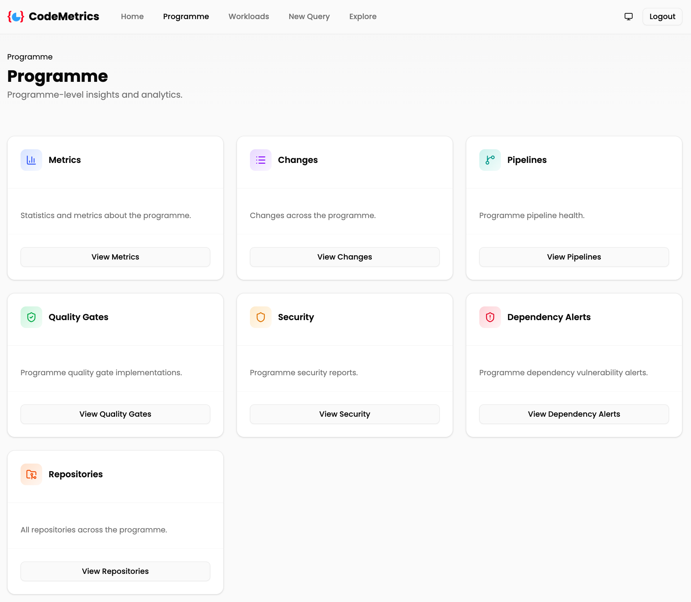

# Programme

## Overview

The Programme page is the entry point for programme-level insights and analytics. It aggregates data from all configured [workloads](./workloads.md) and provides links to drill down into:

- [Metrics](#metrics)
- [Changes](#changes)
- [Pipelines](#pipelines)
- [Quality gates](#quality-gates)
- [Security](#security)
- [Dependency alerts](#dependency-alerts)
- [Repositories](#repositories)

## Metrics

Statistics and metrics about the programme, combining [source code metrics](./query_source_code.md) with [repository churn](./query_repo_churn.md).

## Changes

Recent changes across the programme, including commits and merged pull requests.

## Pipelines

[Pipeline health](./pipelines.md) across the programme.

## Quality gates

[Quality gate](./quality_gates_user.md) implementations across the programme.

## Security

[Vulnerability](./query_vulnerabilities.md) reports for the programme, including uploaded [vulnerability reports](./vulnerability_report_upload.md).

## Dependency alerts

[Dependency vulnerability alerts](./dependency_alerts.md) across the programme.

## Repositories

All [repositories](./repositories.md) across the programme.

## Related pages

- [Workloads](./workloads.md)
- [DORA metrics](./dora.md)
