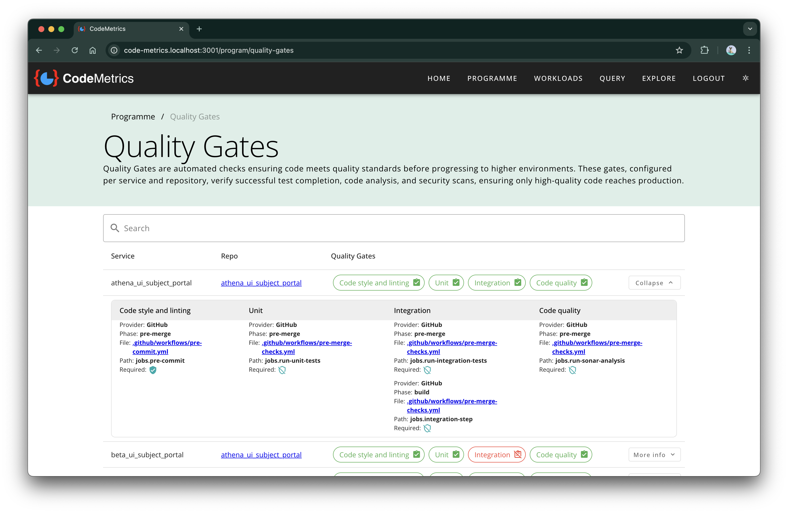
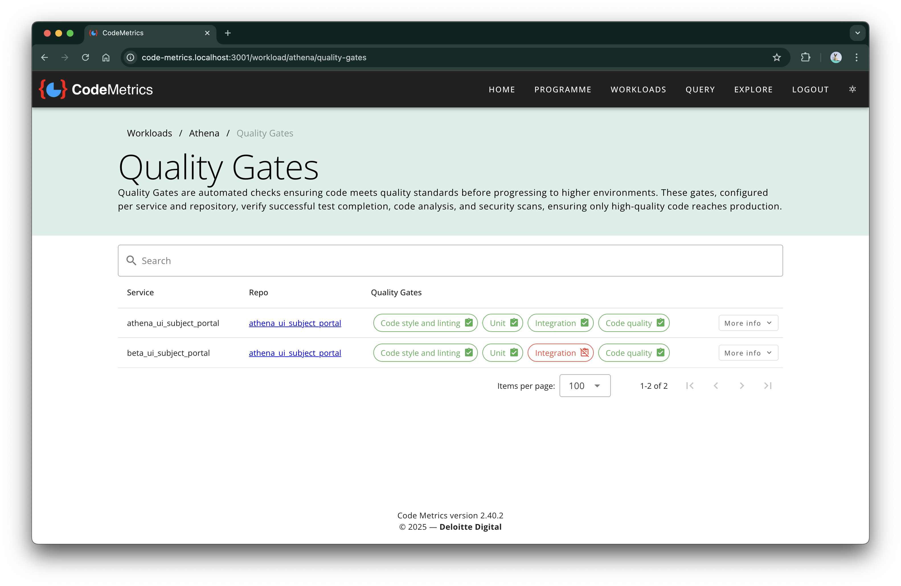

# Quality Gates - User Guide

Quality Gates are automated checks ensuring code meets quality standards before progressing to higher environments. These gates, configured per service and repository, verify successful test completion, code analysis, and security scans, ensuring only high-quality code reaches production.

## Overview

Quality Gates provide visibility into your development process by showing which automated checks are configured for each repository and service. This helps engineering teams understand:

- What quality checks are in place across their codebase
- Which checks are required before code can be merged
- How consistent quality standards are across different repositories
- Where gaps in quality automation might exist

## Accessing Quality Gates

Quality Gates can be viewed at two levels:

### Programme Level

Navigate to **Programme** → **Quality Gates** to see quality gates across all workloads and repositories.

### Workload Level

Navigate to **Workloads** → _[Select Workload]_ → **Quality Gates** to see quality gates for a specific workload.

## Understanding the Quality Gates Dashboard

The Quality Gates dashboard displays information in a table format with the following columns:

### Service

The name of the service as defined in the quality gate manifest file.

### Repo

The repository name, which links directly to the repository in your version control system.

### Quality Gates

Visual indicators showing which types of quality checks are configured:

- **Green badges**: Quality checks that are configured and enabled
- **Red badges**: Quality check types that are not configured
- **Shield icons**: Indicate whether the check is required for merge or optional

Common quality gate types include:

- **Code Style and Linting**: Automated code formatting and style checks
- **Unit**: Unit test execution
- **Integration**: Integration test execution
- **Code Quality**: Static code analysis (e.g., SonarQube)

## Viewing Detailed Information

Click the **More info** button next to any service to expand detailed information about each quality gate:

### Provider

The system that runs the quality check (e.g., GitHub Actions, Azure DevOps).

### Phase

When the check runs in the development lifecycle:

- `pre-merge`: Runs before code can be merged to the main branch
- `build`: Runs during the build process

### File

The configuration file that defines the quality check (e.g., GitHub workflow file).

### Path

The specific job or step within the configuration file.

### Required

Shows whether the check is required for merging (indicated by a shield icon):

- **Shield with check**: Required status check - code cannot be merged without this passing
- **Shield with outline**: Optional check - failure won't block merging

## Searching and Filtering

Use the search box at the top of the dashboard to quickly find specific:

- Service names
- Repository names
- Quality gate types

## Benefits for Development Teams

Quality Gates provide several benefits:

### Consistency

See at a glance which repositories have comprehensive quality checks and which might need additional automation.

### Transparency

Understand what checks new code must pass before reaching production.

### Risk Assessment

Identify repositories with fewer quality gates that might pose higher risk.

### Process Improvement

Use the overview to standardise quality processes across teams and repositories.

## Common Quality Gate Patterns

### Comprehensive Coverage

Well-configured services typically have quality gates for:

- Code style and linting (ensuring consistent code formatting)
- Unit tests (verifying individual components work correctly)
- Integration tests (ensuring components work together)
- Code quality analysis (identifying potential bugs and technical debt)

### Risk Indicators

Services with missing quality gates may indicate:

- Newer repositories that haven't yet implemented full automation
- Legacy services that might benefit from additional quality checks
- Opportunities to standardise development practices

## Next Steps

If you identify repositories with limited quality gate coverage:

1. **Discuss with Development Teams**: Understand any gaps in automated quality checks
2. **Review Configuration**: Check if quality gates exist but aren't properly configured in the manifest
3. **Implement Missing Checks**: Consider adding automated quality checks where appropriate
4. **Standardise Practices**: Use well-configured repositories as templates for others

For information on setting up and configuring Quality Gates, see the [Quality Gates Administration Guide](quality_gates_admin.md).
