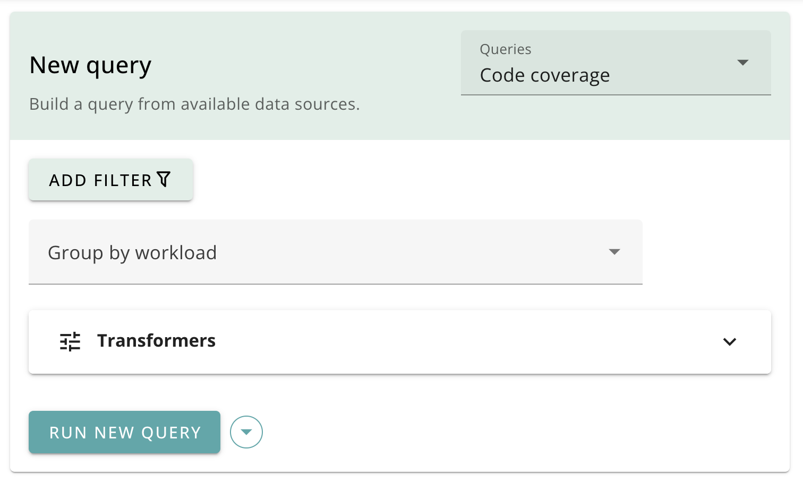
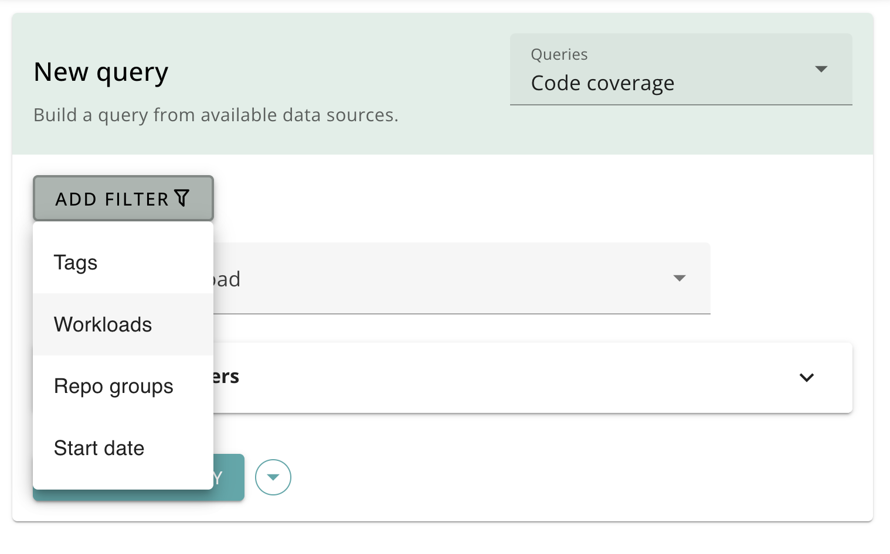
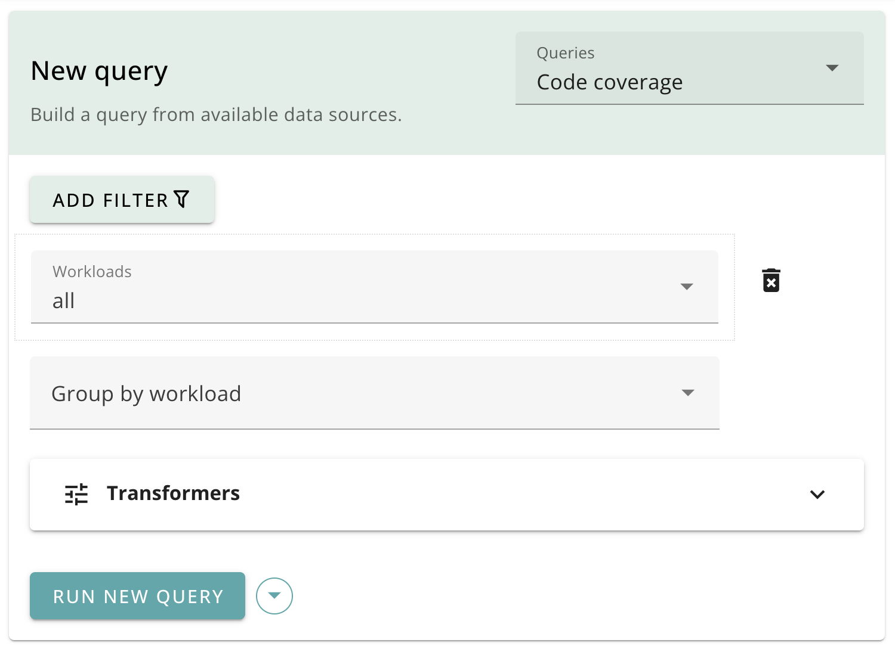
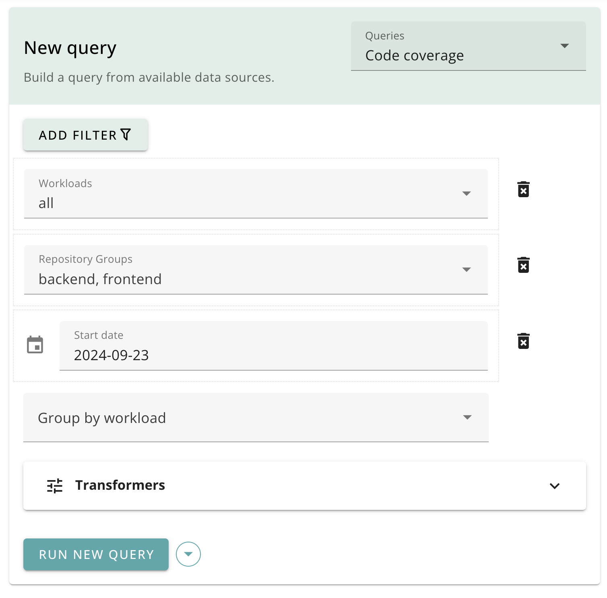
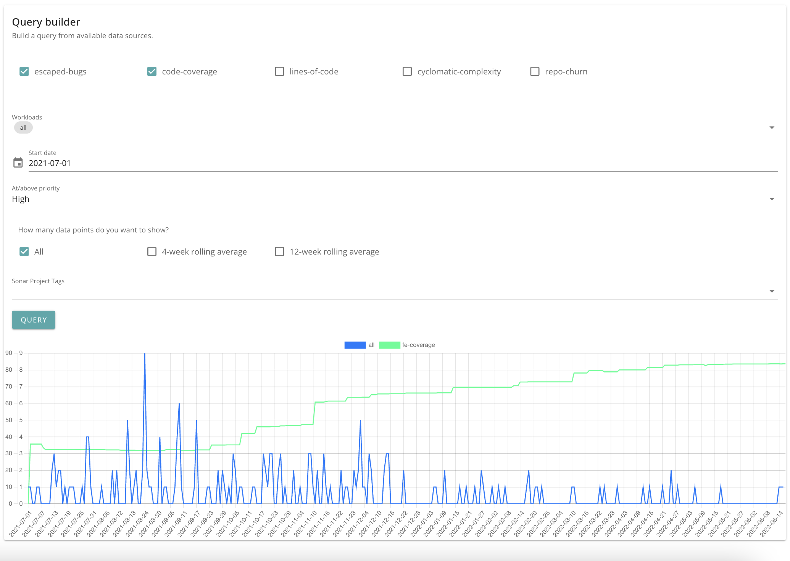

# Queries and filters

Code Metrics provides a number of data sources that you can use to explore your data. You can filter and group your data in a number of ways to get the insights you need.

Visualise your data using a variety of [chart types](./charts.md), such as line, bar, doughnut and table.

These include:

- Source code metrics
- Build and deployment pipelines
- Repository churn
- Bug culprit files
- Bugs and escaped bugs
- DORA metrics
- Vulnerabilities
- Pull Request (PR) metrics

See the [query types](./query_types.md) page for more details on each query type.

## Query filters

When creating a query, you can filter based on a number of criteria, such as:

- workload/team
- repository group
- date
- custom tags
- etc.

### Adding filters

Choose the **Add filter** button on the query screen.

From the drop-down list, add one or more filters:

> **Note**
> The list of available filters depends on the queries you have selected.

You can add one or more filters:

To remove a filter, click the delete button to the right of the filter:

## Query builder

Code Metrics provides a custom query builder, which allows you to combine datasets from one or more query types, such as source code metrics, tickets etc.

The query builder supports timeseries datasets.

For example, you could chart the following:

- what is the bug to change ratio?
- how does test coverage correlate to escaped bugs?
- how has complexity changed with codebase size?
- how much churn has there been in the codebase (i.e. additions, edits, deletions)

### Custom queries

Custom queries are combinations of query types and default inputs that you can use to tailor the tool to a particular analysis, workload or repository.

You can define custom queries using a JSON file. See [custom queries](custom_queries.md) for details.

### Data points and rolling averages

You can choose to chart all data points, which is most accurate, but can be quite spiky for some datasets. You can also choose to add rolling averages (over 4 weeks or 12 weeks). 
