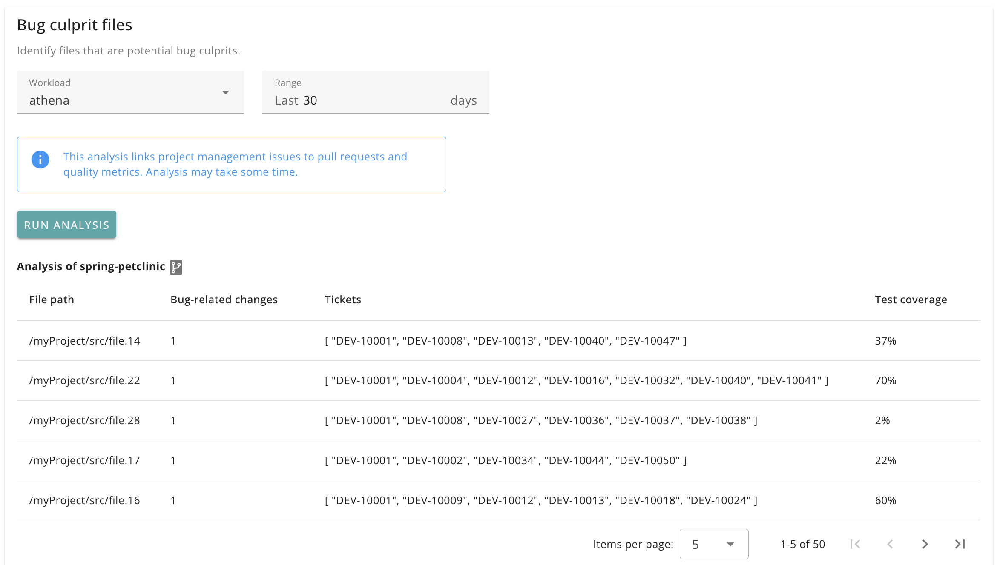

# Bug culprit files

Identifies files that are frequently changed in response to bug fixes. These are potential 'culprits' for code that needs attention.

Available dimensions:

- workload name

## UI

