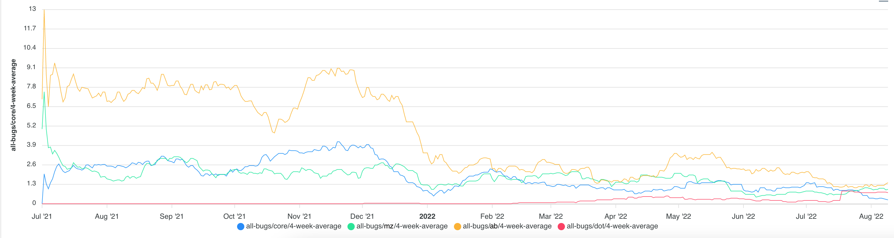

# Bugs and escaped bugs

Bugs/defects from the ALM tool, such as Jira. Helpful to correlate against other software quality metrics.

Available dimensions:

- workload name
- issue priority

## UI

Shows all bugs, by workload, at/above a given priority.

