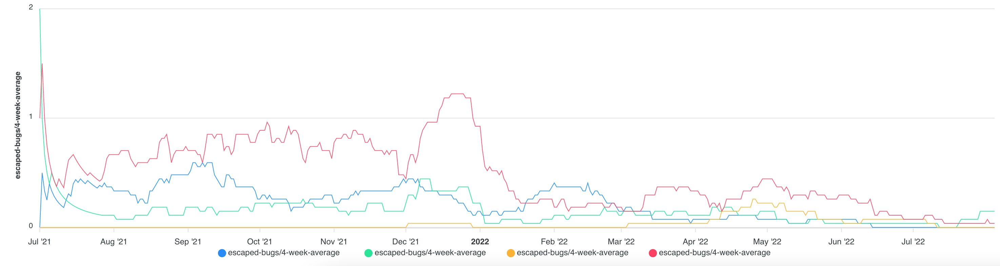

# Bugs and escaped bugs

Bugs/defects from the ALM tool, such as Jira. Helpful to correlate against other software quality metrics.

Available dimensions:

- workload name
- issue priority
- escaped (production) only

## UI

### Escaped bugs

Shows all the bugs that 'escaped' to production, by workload, at/above a given priority.

### All bugs

Shows all bugs, by workload, at/above a given priority.

