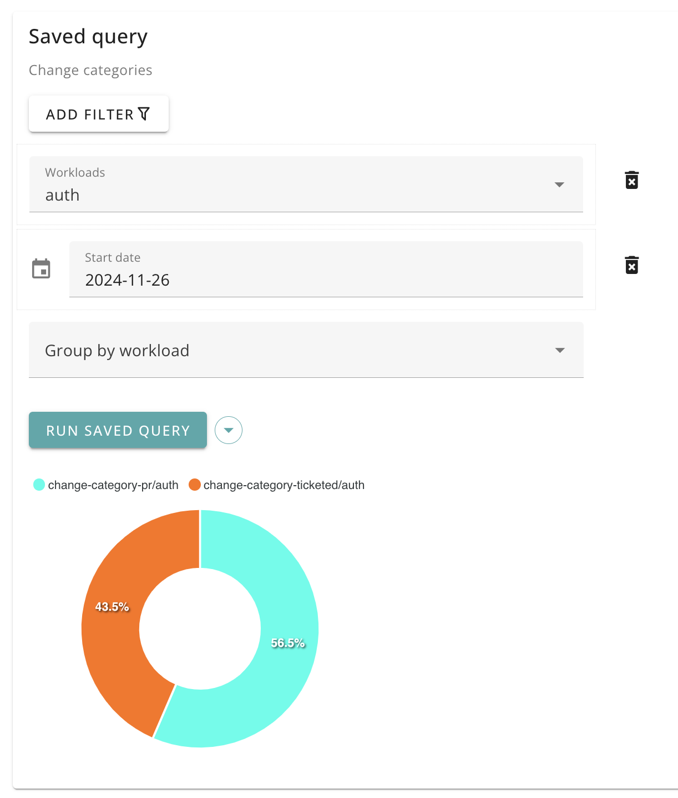

# Change types

You can report on the types of changes that teams are making to the codebase.

In particular, you can see, for each commit, whether the there was an associated Pull Request or ticket.

The default categories are:

- Commit only
- Pull Request
- Ticketed change

Available dimensions:

- workload name

## UI

Shows all changes that occurred in repositories, by workload.

