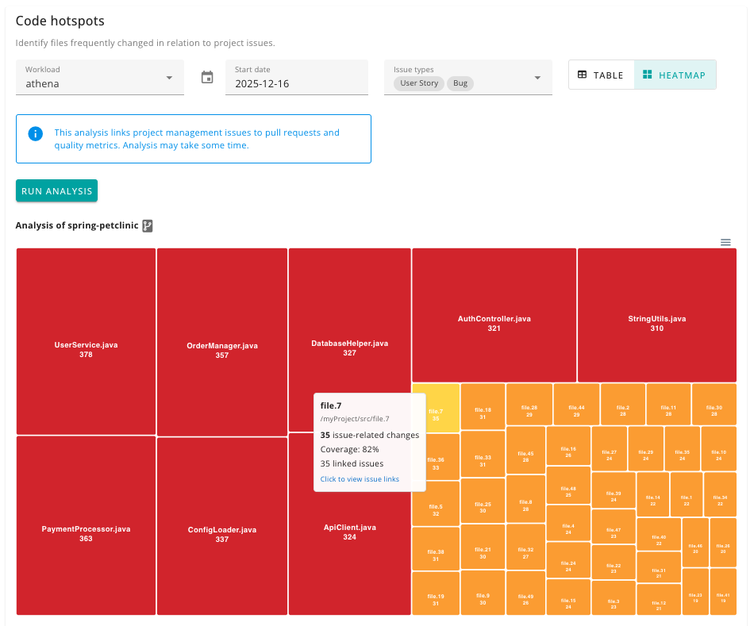
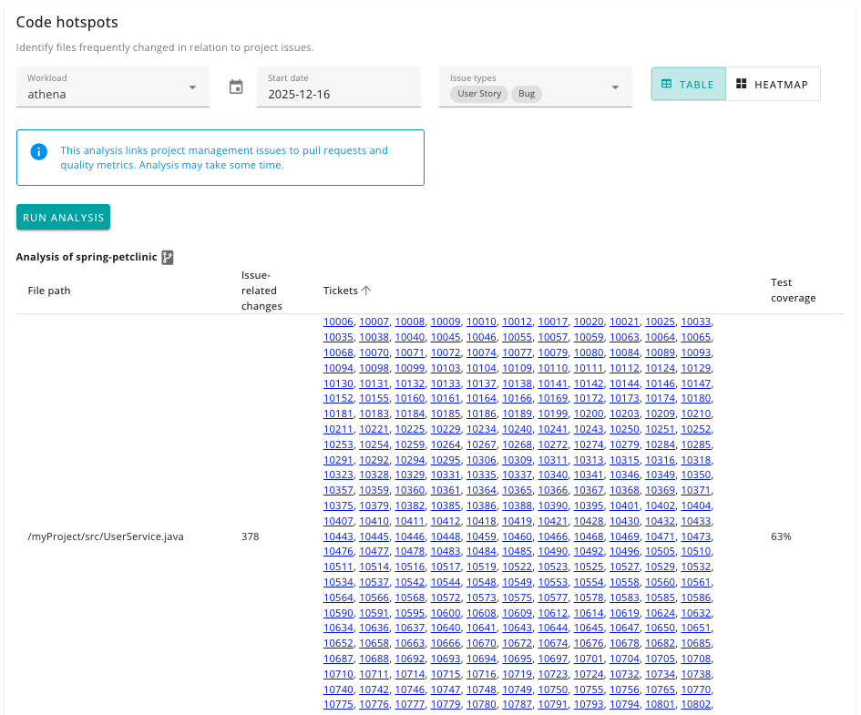

# Code hotspots

Identifies files that are frequently changed in relation to project issues. These are potential hotspots that may need attention or refactoring.

Available dimensions:

- workload name
- start date
- issue types (Bug, Task, User Story, Defect, Issue, etc.)

## UI

Code Hotspots can be viewed in two modes:

### Heatmap View (Default)

The heatmap provides a visual treemap representation where:

- **Cell size** is proportional to the number of issue-related changes
- **Cell colour** indicates heat intensity:
  - 🟡 **Amber/Gold** - Low frequency (bottom third)
  - 🟠 **Deep Orange** - Medium frequency (middle third)
  - 🔴 **Red** - High frequency (top third)

Clicking on any cell opens a dialog showing:

- File path
- Number of issue-related changes
- Code coverage (if available)
- Clickable links to related issues in your ticket system (Jira, GitHub, Azure DevOps, etc.)

### Table View

The traditional table view shows the same data in a sortable table format with columns for file path, change count, coverage, and linked issue IDs.

Use the toggle button in the top-right corner to switch between views.
