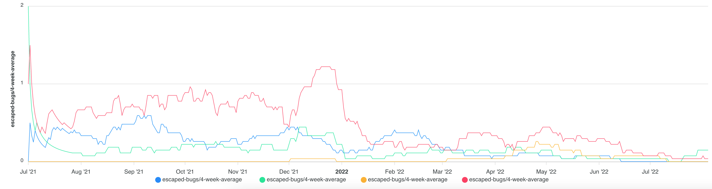

# Production incidents

You can report on, query and analyse incidents that have occurred in your production environment.

Incident tickets in a project management tool or service management tool are supported.

> **Note**
> See the [incident configuration](./config_incidents.md) documentation for information on how to configure incidents.

Available dimensions:

- workload name
- issue priority

## UI

Shows all incidents that occurred in production, by workload, at/above a given priority.

