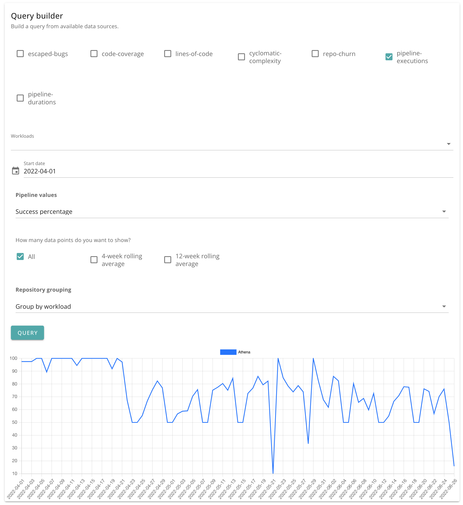

# Build and deployment pipelines

Duration, success percentage and outcomes of build and deployment pipelines.

Metrics include:

- Pipeline outcomes (successful/failed/aborted)
- Pipeline success percentage
- Pipeline execution duration

Available dimensions:

- Workloads

## Pipeline outcomes (successful/failed/aborted)

## Pipeline success percentage

## Pipeline execution duration

