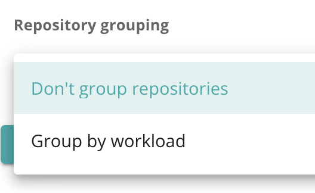
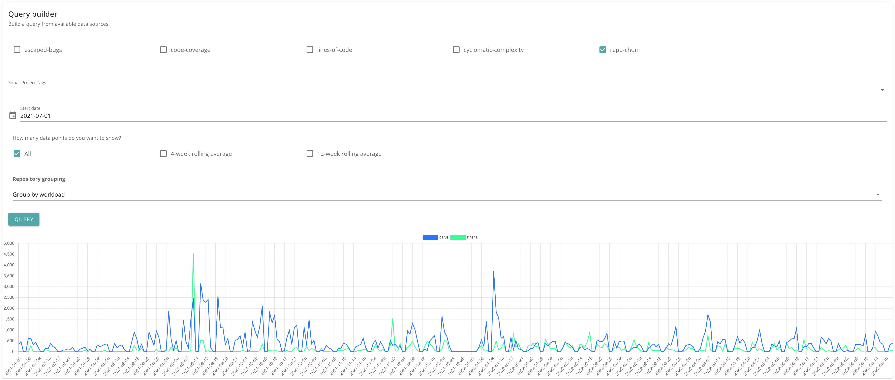
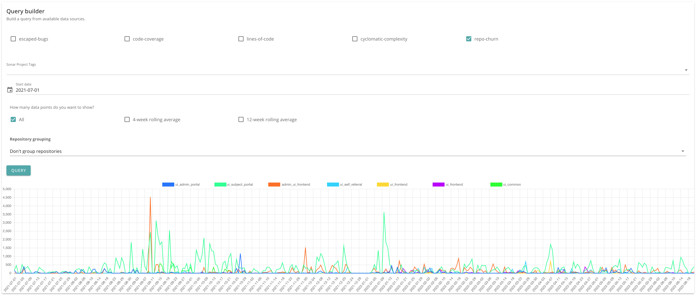

# Repository churn

A metric showing the amount of change in a repository.

Available dimensions:

- Sonar tags

### Calculating churn

Churn can be calculated as follows:

| Strategy                   | Meaning                                                                                                                    |
|----------------------------|----------------------------------------------------------------------------------------------------------------------------|
| ADD_EDIT_SUBTRACT_DELETE   | Added lines and edited lines count positively toward the total. Deleted lines subtract from the total.                     |
| ADD_EDIT_DELETE_CUMULATIVE | Added, edited and deleted lines all count positively toward the total.                                                     |
| COUNT                      | Ignore number of lines change and count only the instances of a change. i.e. an addition of 10 lines counts as one change. |

Currently, `ADD_EDIT_DELETE_CUMULATIVE` is used, to avoid the possibility of a negative value when there are more deletions than additions/edits. Although this would not be problematic in theory, it leads to some unhelpful graph axis issues when overlaying multiple timeseries datasets.

## Grouping results

You can group the results by workload, or view results for each repository.

### With grouping

### Without grouping

## Implementation notes

### Concurrency

Commit retrieval is not very efficient, so a few strategies are used. In future, a wider date range could be provided to the ADO API, however, this would need to be balanced against pulling values from the cache, which might lie in the middle of a given date range.

For now, a MongoDB-based store is used to hold a summary of commits and change types (added, edited, deleted) by day, by repo.

In addition, to avoid getting rate-limited by the ADO API, a concurrency limit is set (currently 4), using [bottleneck](https://www.npmjs.com/package/bottleneck).
