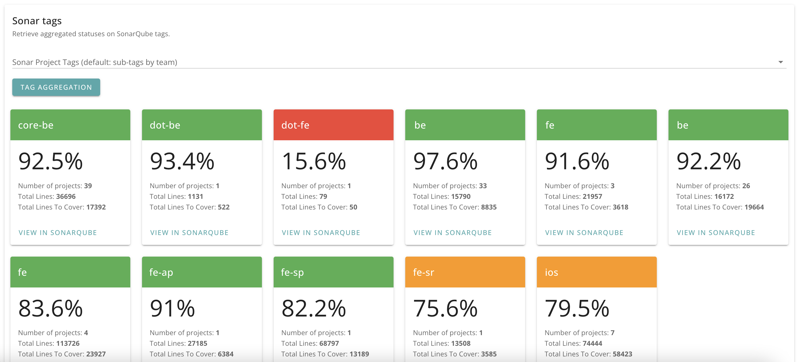
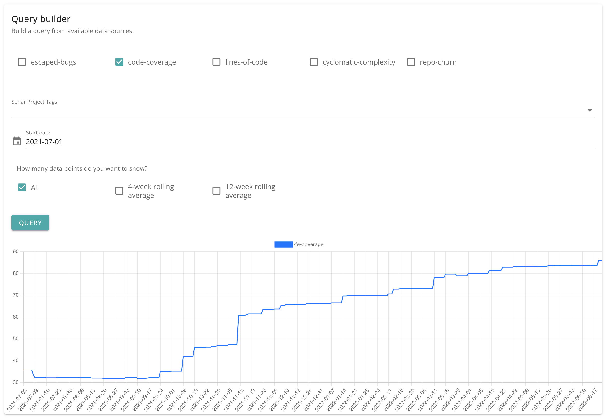
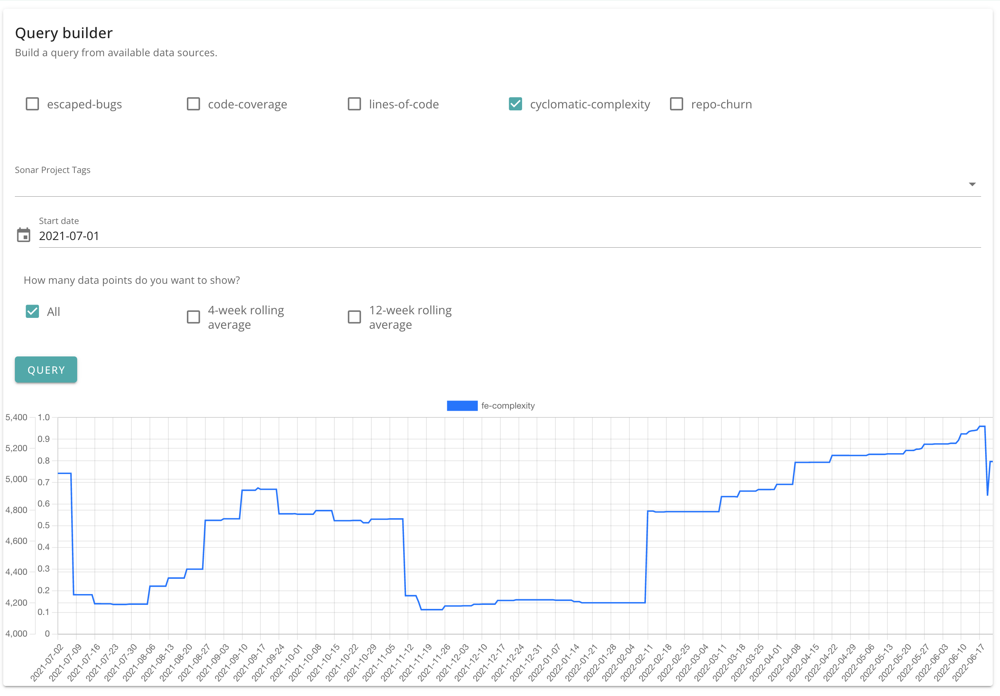

# Source code metrics

Data about the structure, complexity and health of your codebase.

Metrics include:

- Test coverage
- Cyclomatic complexity
- Lines of code (ncloc)

Available dimensions:

- Sonar tags

## Test coverage, aggregated

## Test coverage, timeseries chart

## Cyclomatic complexity

## Lines of code (ncloc)

