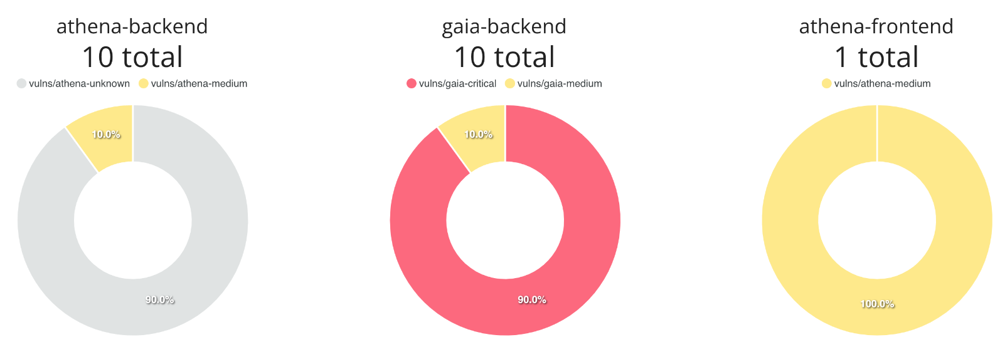

# Vulnerabilities

A metric showing the number and severity of vulnerabilities for a repository.

Available dimensions:

- Workload
- Repository

## Data source

The source of the vulnerability data is [SARIF](https://sarifweb.azurewebsites.net/) files.

Data can be uploaded using the Code Metrics API, or [the report uploader](./vulnerability_report_upload.md) user interface.

## Query details

The query is found on the `Security` page, which hosts a doughnut chart version of the vulnerabilities query data:

