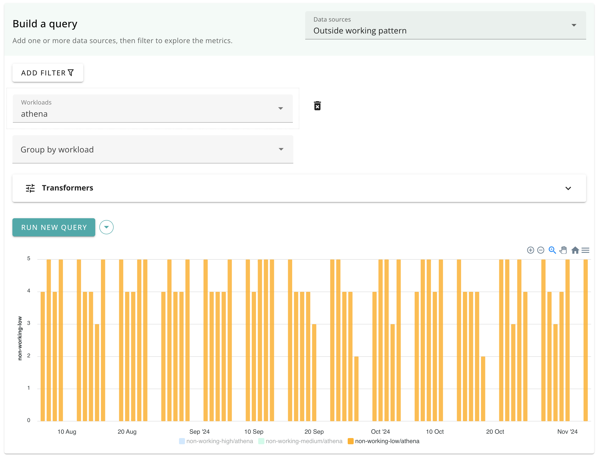

# Changes outside working pattern

A metric showing the number of changes (commits) made outside of a team's working hours or days.

Available dimensions:

- Workload
- Repository group



## Data source

The source of the data is the set of commit timestamps from the version control system configured for the workload.

## Query details

Changes are shown if they are made outside the configured working pattern for the team.

| Category | Range                                             |
|----------|---------------------------------------------------|
| Low      | Up to 1 hour                                      |
| Medium   | Up to 3 hours                                     |
| High     | More than 3 hours or outside working pattern days |

## Configuration

Configure a working pattern for a team in its [workload configuration](./config_workloads.md).

```yaml
workloads:
  - id: my-team
    name: My Team
    team:
      workingPattern:
        # Starting hour (24 hour clock).
        # Default: 9
        startHour: number
        
        # End hour (24 hour clock).
        # Default: 17
        endHour: number
        
        # Day name or number (0-6, starting on Sunday).
        # Default: "Monday"
        startDay: number | string
        
        # Day name or number (0-6, starting on Sunday).
        # Default: "Friday"
        endDay: number | string
        
        # The timezone to use for working pattern calculations.
        # e.g. `UTC` or `America/New_York`.
        # Default: "UTC"
        timezone: string
```
