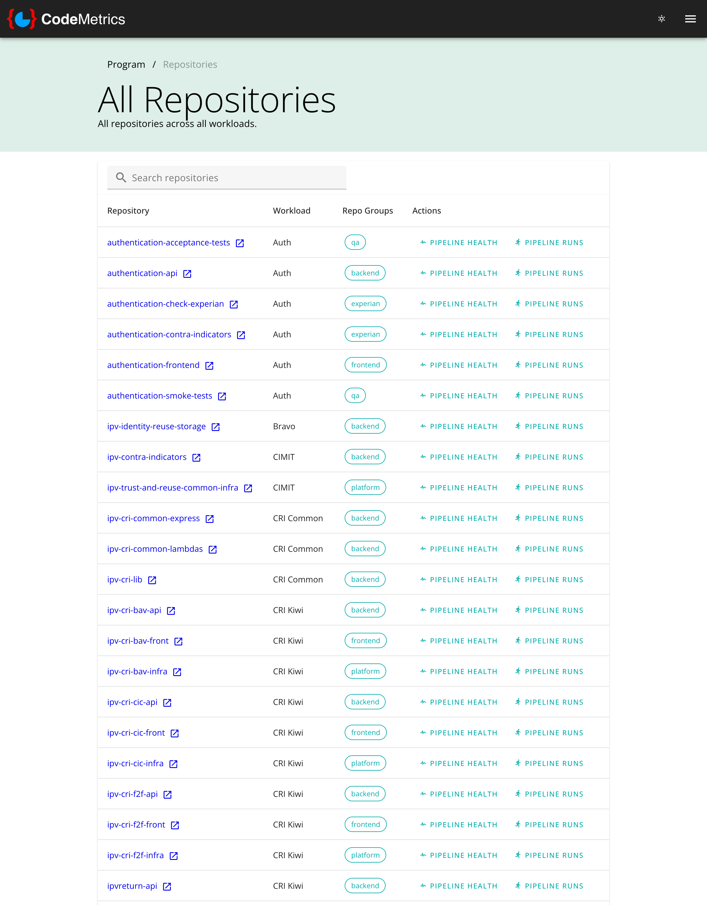
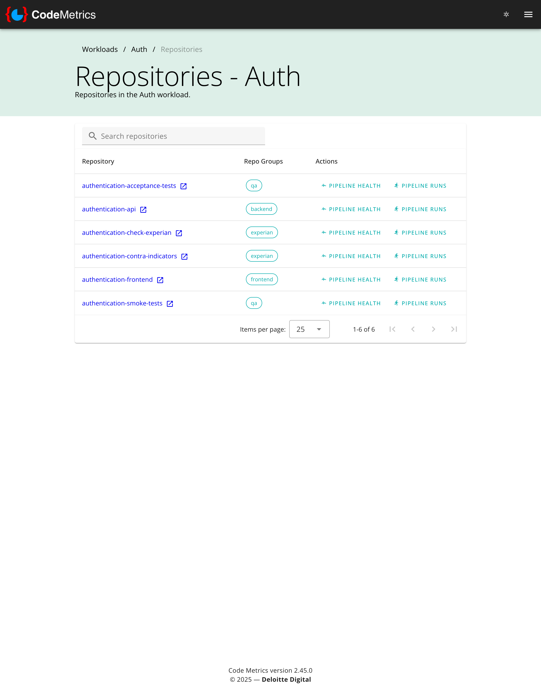

# Repositories

The Repositories page provides a consolidated view of all code repositories across the programme or within a specific workload.

## Programme-level view

Access the Repositories page from the Programme menu to see all repositories across all workloads.

The table includes:

- **Repository name** - links to the repository in your code management platform
- **Workload** - the workload that owns the repository
- **Repo Groups** - all repository groups the repository belongs to
- **Actions** - quick links to Pipeline Health and Pipeline Runs for the repository

Use the search box to filter repositories by name.

## Workload-level view

Access the Repositories page from a specific Workload to see only that workload's repositories.

The workload-filtered view shows:

- **Repository name** - links to the repository in your code management platform
- **Repo Groups** - all repository groups the repository belongs to (a repository may belong to multiple groups)
- **Actions** - quick links to Pipeline Health and Pipeline Runs

The action links automatically include the workload and branch context, making it easy to navigate to pipeline metrics for specific repositories.
