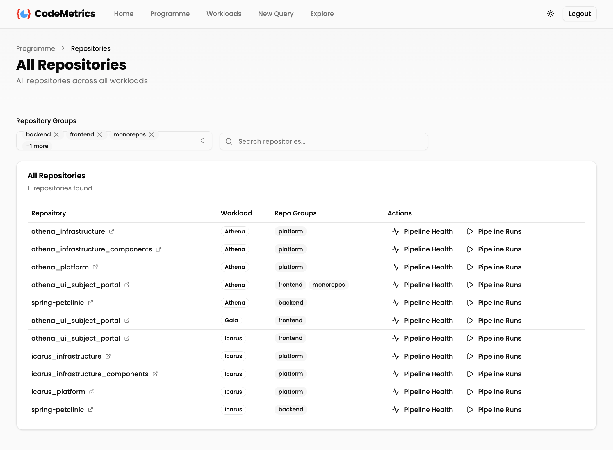
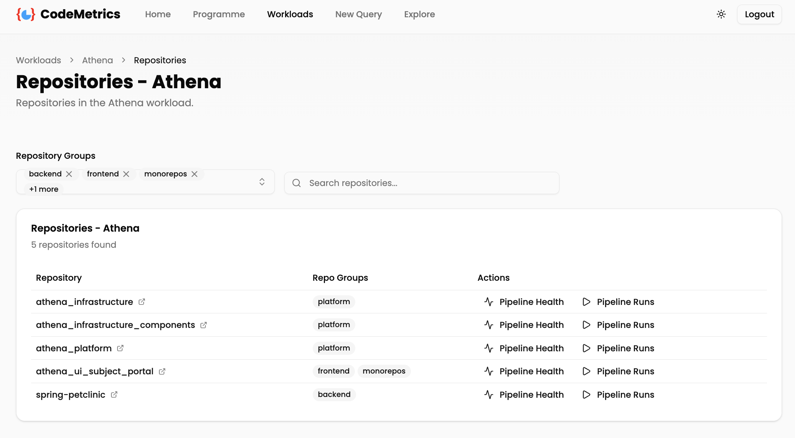
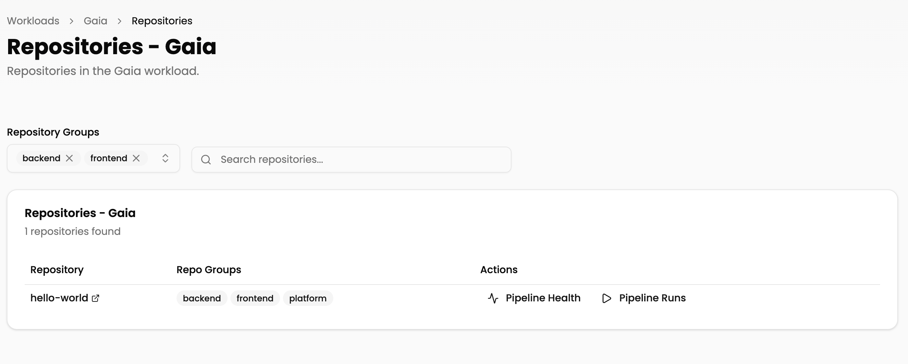
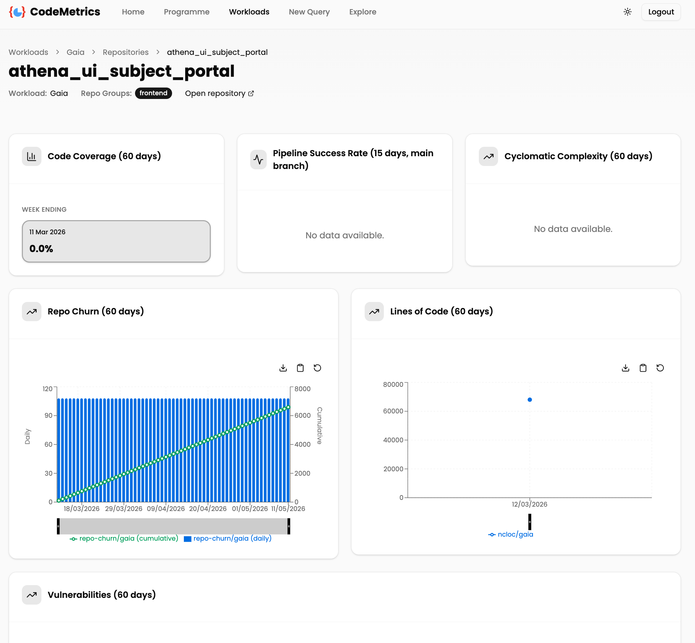

# Repositories

The Repositories feature gives you a consolidated view of every code repository tracked by CodeMetrics — either across your entire programme or scoped to a specific workload. From here you can quickly navigate to pipeline health dashboards, inspect individual repository metrics, and narrow down large repository lists using filters.

---

## Programme-level view

Navigate to **Programme > Repositories** to see all repositories across every workload in one place.

This view is useful when you want to:

- **Audit your full repository estate** — see every repository tracked across all workloads and their associated repo groups at a glance.
- **Spot cross-workload patterns** — the same repository may appear in multiple workloads (e.g. a shared library consumed by several teams), letting you identify shared dependencies.
- **Quickly navigate to pipeline metrics** for any repository without first drilling into a workload.

The table columns are:

| Column | Description |
|---|---|
| **Repository** | The repository name. Click the external link icon to open the repository in your code management platform (e.g. GitHub). |
| **Workload** | The workload that owns this repository entry. |
| **Repo Groups** | The repo groups this repository belongs to (e.g. `backend`, `frontend`, `platform`). A repository may belong to multiple groups. |
| **Actions** | Quick links to **Pipeline Health** and **Pipeline Runs** for this repository. |

---

## Workload-level view

Navigate to a specific workload and select **Repositories** from the breadcrumb or workload menu to see only the repositories belonging to that workload.

This is the most common starting point for a team lead or engineer who wants to:

- **Review build health across a team's repositories** — all repositories are listed with direct links to Pipeline Health and Pipeline Runs.
- **Check repo group membership** — confirm which groups each repository belongs to, which affects how metrics are aggregated in queries.
- **Navigate to a specific repository's detail page** to inspect deeper metrics (see [Repository detail](#repository-detail) below).

The workload view shows the same columns as the programme view, minus the **Workload** column (since it is already implicit).

---

## Filtering and searching

Both the programme-level and workload-level views support filtering to help you find repositories quickly in large estates.

### Filter by Repository Group

Use the **Repository Groups** multi-select control to narrow the list to repositories that belong to one or more specific groups (e.g. `backend`, `frontend`, `monorepos`). This is particularly useful when:

- You want to check the pipeline health of all `frontend` repositories across a workload.
- You are investigating a specific tier (e.g. `platform`) without distraction from unrelated repositories.

Selected groups are shown as removable tags. Click the **×** on any tag to deselect it, or use the dropdown to add groups. The repository count updates immediately to reflect the active filter.

### Search by name

Use the **Search repositories…** text box to filter the list by repository name. This is a simple substring match and is useful when you know the repository name but are working with a large, unfiltered list.

Filters and search can be combined — for example, filtering to the `frontend` group and then searching for a specific repository name within that group.

---

## Repository detail

Click a repository name in any list to open its detail page, which shows a rich set of metrics for that specific repository.

The detail page shows the repository's workload and repo group membership at the top, along with a direct link to open the repository in your code management platform.

Below that, a set of metric cards provides an at-a-glance summary:

| Metric | Description |
|---|---|
| **Code Coverage** | Test coverage percentage over the last 60 days, shown week by week. |
| **Pipeline Success Rate** | The rate of successful pipeline runs on the main branch over the last 15 days. |
| **Cyclomatic Complexity** | Code complexity trend over the last 60 days. |
| **Repo Churn** | Daily and cumulative file churn over the last 60 days — a high churn rate can indicate instability or frequent rework. |
| **Lines of Code** | Codebase size trend over the last 60 days. |
| **Vulnerabilities** | Known vulnerability trend over the last 60 days. |

Cards that have no data for the selected period display **No data available** — this typically means the relevant data source has not yet been configured for that repository.

### Common scenarios

**Rapidly assessing build health**
: Open the repository detail page and check **Pipeline Success Rate**. A low success rate on the main branch is an early indicator of instability. Use the **Pipeline Health** action link from the repository list to go directly to the pipeline health dashboard for a more detailed breakdown.

**Tracking codebase growth and churn**
: Use **Lines of Code** alongside **Repo Churn** to understand whether growth is accompanied by high levels of rework. A rising cumulative churn with a plateauing lines-of-code count may indicate significant refactoring or instability.

**Monitoring test coverage trends**
: The **Code Coverage** card shows weekly snapshots. A declining trend over time warrants attention, particularly before a planned release.

**Investigating vulnerabilities**
: The **Vulnerabilities** card gives a quick indication of whether known vulnerabilities are trending upward. For a full vulnerability report, see [Vulnerabilities](./query_vulnerabilities.md).

---

## Related pages

- [Workloads](./workloads.md)
- [CI/CD Pipelines](./pipelines.md)
- [Pipeline Health query](./query_pipelines.md)
- [Repository Churn query](./query_repo_churn.md)
- [Source Code Metrics query](./query_source_code.md)
- [Vulnerabilities](./query_vulnerabilities.md)
