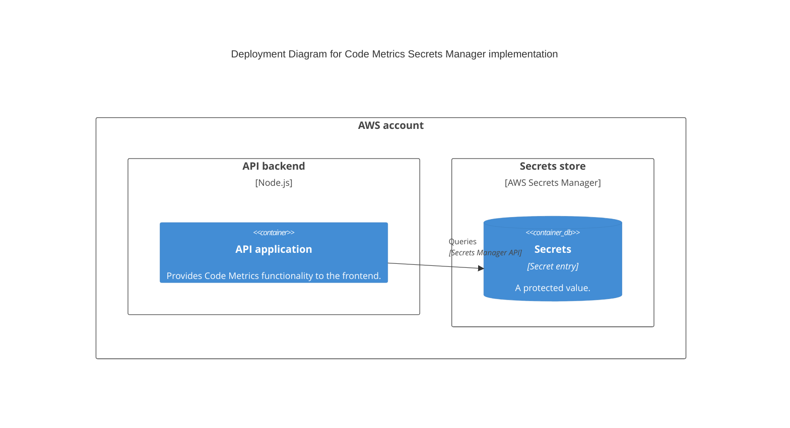

# Managing secrets

Typically, the systems you query with Code Metrics require authentication. You configure how to access these systems using the `remote-config.yaml` / `remote-config.json` files in your configuration directory.

> **Note**
> See the [configuration guide](./configuration.md) for more details about the `remote-config.yaml` file.

It is good practice to avoid putting sensitive values, such as API keys, passwords etc. in these files, and instead externalise them to a safe place.

## Secret placeholders

When you want to refer to a secret in a configuration file, you can use the following syntax:

```
${secret.SECRET_NAME}
```

for example:

```
${secret.sonar_api_key}
```

## Secret resolution

When Code Metrics parses your configuration files and it encounters a secret placeholder, it uses a _Secret Resolver_ to obtain the real value.

By default, a file-based secrets resolver is used. There are other, more secure, secrets resolvers.

Set the resolver to use with the `SECRET_RESOLVER_IMPL` environment variable.

> For example:
>
> ```
> SECRET_RESOLVER_IMPL=file
> ```

### File-based resolver (default)

Set the environment variable:

```
SECRET_RESOLVER_IMPL=file
```

This resolver reads a file named `secrets.yaml` in your config directory.

The file is a simple key/value map.

```yaml
# secrets.yaml
sonar_api_key: "super secret value"
another_secret: "open sesame"
```

> To refer to these secrets in your configuration, use the key of the secret in the file as the secret name, such as: `${secret.sonar_api_key}`

### AWS Secrets Manager resolver

Set the environment variable:

```
SECRET_RESOLVER_IMPL=secretsmanager
```

This resolver queries AWS Secrets Manager using the secret name as the `SecretId`.

To use this resolver, set up your secrets with the correct names and ensure the Code Metrics backend has the necessary AWS permissions (e.g. using IAM or AWS configuration files) to read those secrets' values.

The IAM permission required is:

```
secretsmanager:GetSecretValue
```

<details>
<summary>Example IAM policy document</summary>

This example IAM policy scopes read access to secrets with names in the format `codemetrics/*`, but you can be a specific as required by your environment.
```json
{
  "Version": "2012-10-17",
  "Statement": [
    {
      "Action": [
        "secretsmanager:GetSecretValue"
      ],
      "Effect": "Allow",
      "Resource": "arn:aws:secretsmanager:us-east-1:000000000000:secret:codemetrics/*"
    }
  ]
}
```
</details>

> To refer to these secrets in your configuration, use the ID of the secret in Secrets Manager as the secret name in the placeholder, such as: `${secret.some/secret}`

#### Architectural overview


