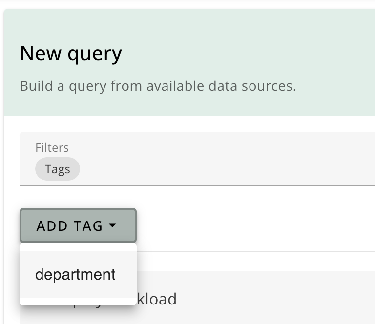
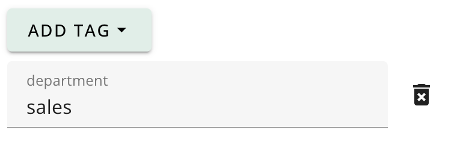
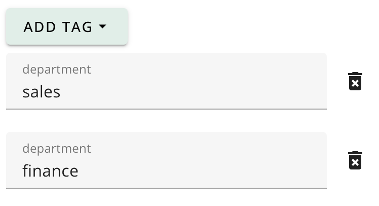
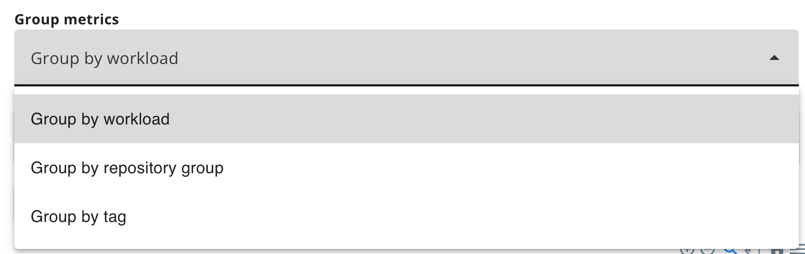
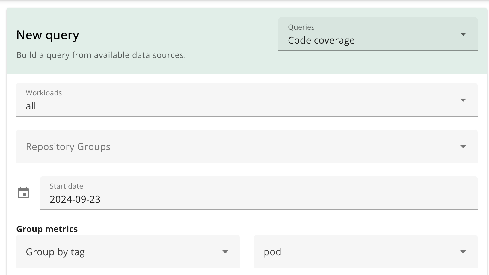

# Tags

You can add tags to workloads to allow you to group them in ways that make sense for you. For example, you might add a 'department' tag to group workloads together.

You can use tags to help you explore your workloads in two ways:

- **Filtering**: You can filter workloads by tags to see only the workloads that are relevant to you.
- **Grouping**: You can group your query results using tags to see how they are distributed across different categories.

## Adding tags to a workload

To add tags to a workload, use the `tags` field in the [workload configuration](./config_workloads.md):

```yaml
workloads:
  - id: athena
    tags:
      department: sales
      country: UK
    # ... other workload config

  - id: gaia
    tags:
      department: finance
      country: UK
    # ... other workload config
```

## Filtering workloads by tags

You can filter workloads by tags using the `tags` field in the workload query:



For example, to filter workloads by the `department` tag:



The available values for the tag are those used in the workload configuration.

You can also filter workloads that match one of multiple tags:



## Grouping workloads by tags

You can group your query results by tags using the `tags` field in the workload grouping menu:



Set the tag to group by:


