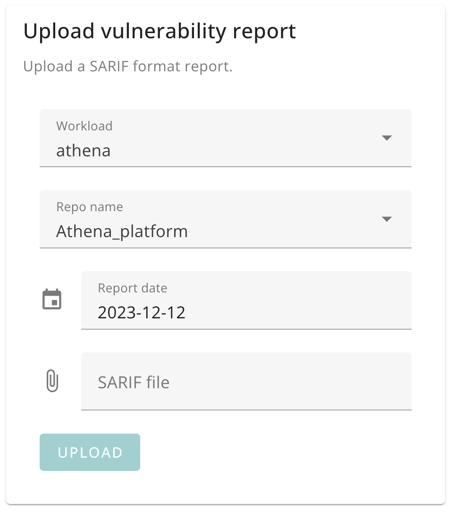
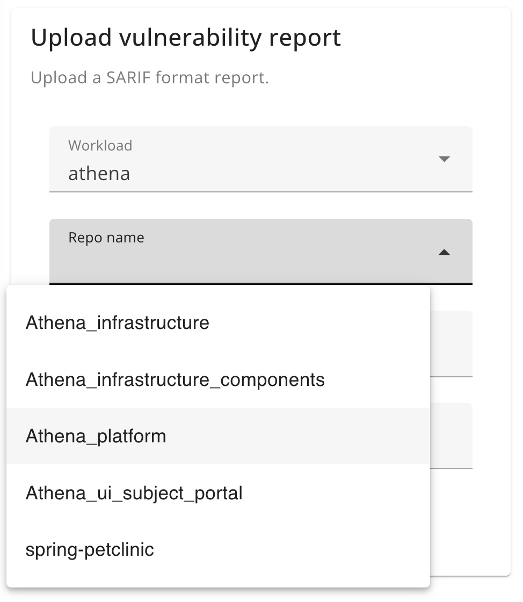

# Uploading vulnerability reports

This feature supports the [vulnerabilities query](./query_vulnerabilities.md).

[SARIF](https://sarifweb.azurewebsites.net/) files are how Code Metrics understands software vulnerabilities in your repositories.

SARIF files can be uploaded using the Code Metrics API or the Report Upload UI.

## Report Upload UI

The uploader API accepts SARIF format files and stores them in the data store.

This is the uploader UI component:

{: style="width:482px"}

When the workload is selected, the list of relevant repos for that workload is prepopulated for selection.

{: style="width:487px"}

## Report Upload API

Example SARIF upload:

    curl -H 'Content-Type: application/json' \
         -H 'Authorization: Bearer eyJhbGciOiJI...'
         -d "@example.sarif" "http://localhost:3000/api/vulnerabilities?workload=athena&repoName=spring-petclinic&reportDate=2023-12-11"

## Storage

SARIF files are parsed on upload and metadata such as code repository and severity are extracted.

> **Note**
> If repository name was provided during upload, this takes precedence over the metadata within the file.

### Vulnerabilities query

See the [vulnerabilities query](./query_vulnerabilities.md) documentation.
