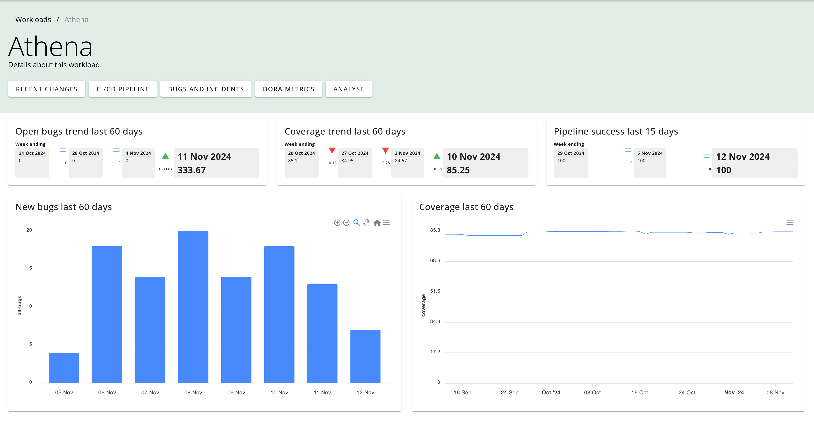

# Workloads

## Overview

A workload represents one or more repositories, in one or more repository groups. With this concept, you can model a team, an application or a single component.

> **Note**
> See the [workload configuration](./config_workloads.md) section.

## Workload summary

Each workload has a summary page, showing recent trends.

It provides a view of:

- bugs
- test coverage
- pipeline success rate

It also provides links to drill down into:

- [DORA metrics](./dora.md)
- recent changes (commits, merged PRs etc.)
- [bugs](./query_bugs.md) and [incidents](./query_incidents.md)
- [recent CI/CD runs and build health](./pipelines.md) 
- bug analysis
- [quality gates](./quality_gates_user.md)
- [dependency alerts](./dependency_alerts.md)

You can view a list of all workloads:

## Grouping workloads

Workloads can be grouped together. This is useful for viewing a summary of all workloads in a group. You group workloads using [tags](./tags.md).
